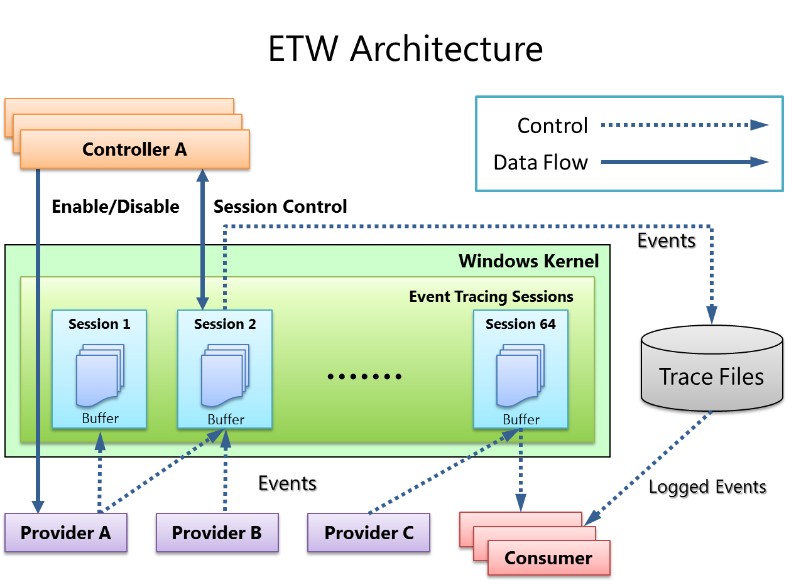

::: block
*Benchmark.Net* {style=background:red;width:500px}
:::

---

### What's the talk about?

How Stephen Toub used [Benchmark.net](https://github.com/dotnet/BenchmarkDotNet) in [his Microsoft Build session](https://youtube.com/watch?v=TRFfTdzpk-M&si=f_qi44B92f6hxnrt) to micro-optimize some code, and why you should use the methods he did.

---

### Interstitial

[Toub and Hanselman talk about performance and implementation on the dotnet YouTube channel](https://www.youtube.com/results?search_query=toub)

---


---

### An ages old way to understand your application

- Occasionally break into the application and look at the call stack (but beware that it tells you where the application is going and not where it has been)

- Run a profiler to understand the higher level flow and where the time goes (CPU or memory, sampling or instrumenting, allocation stacks)

- Isolate down to the level of methods (but its hard to isolate enough)

---


---


---


---


---


---

```csharp
BenchmarkSwitcher.FromAssembly(typeof(Tests).Assembly)
  .Run(args);
```

```csharp
[MemoryDiagnoser]
public class Tests
{
    [Benchmark]
    public void CallWithParams()
    {
        var result = Called(1, 2, 3, 4, 5, 6);
        if (result != 3)
        {
            throw new Exception("Something is wrong.");
        }
    }
```

---

```csharp
    int Called(params int[] args) => args[2];
```

```csharp
    int Called(params ReadOnlySpan<int> args) => args[2];
```

---

```powershell
PS Test\bin\Release\net9.0> pushd ../../..
PS Test> dotnet build -c Release
PS Test> popd
PS Test\bin\Release\net9.0> .\ConsoleApp1.exe --filter *Test*
```

---


---


---

### But a level down?


---



---


---


---

### Conclusion

- Find where it doesn't match your mental model, or just where loads of time is spent.

- Isolate and fix.
