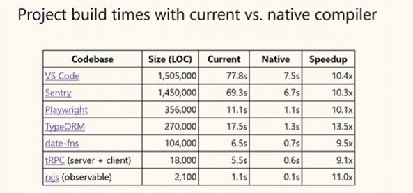
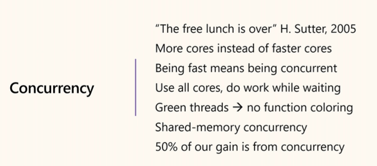
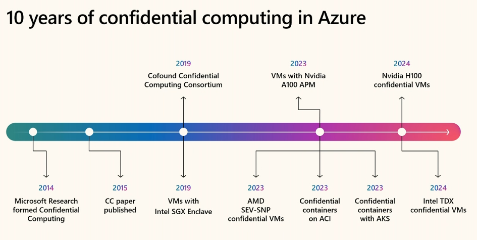

::: block
*Build Recap of some sessions* {style=background:red;width:500px}
:::

---

### What are we covering?

We'll cover parts of a few of the talks from Build.

---

### Quick Impression of Build

Not as in-depth tech as in previous years, this one covered the arrival of AI into the business and developer experience.

- Agents, agents, agents
- Orchestration of Agents
- Agents talking to tools (MCP) or Agents (A2A)
- CoPilot taking on issues and working collaboratively to solve a problem

---

### Weirdest things

[Running .NET source files `dotnet run app.cs`](https://www.youtube.com/watch?v=98MizuB7i-w)

I just don't get it. You have scripting languages and programming languages, and very few can straddle the divide.

---

These are the talks from the [playlist](https://www.youtube.com/playlist?list=PLFPUGjQjckXH1BDmT9hZw_fUi9NZRbVJt):

- [Yet Another "Highly Technical Talk" with Hanselman and Toub](https://www.youtube.com/watch?v=J3IQBI5HVOw)
- [Python Meets .NET: Building AI Solutions with Combined Strengths](https://www.youtube.com/watch?v=fDbCqalegNU)
- [A 10x Faster TypeScript with Anders Hejlsberg](https://www.youtube.com/watch?v=UJfF3-13aFo)
- [Inside Azure innovations with Mark Russinovich](https://build.microsoft.com/en-US/sessions/BRK195?source=sessions)

---

### [Yet Another "Highly Technical Talk" with Hanselman and Toub](https://redgate.slack.com/archives/C08T9FBAM6D/p1747848365112169)

- Hanselman and Toub are really good as a presenting pair
- This time they implement (most of) Channels - like the Go feature that ripped off CSP

---

```CSharp
using System.Threading.Channels;

Channel<int> c = Channel.CreateUnbounded<int>();

_ = Task.Run(async () =>
{
    for (int i = 0; i < 10; i++)
    {
        await c.Writer.WriteAsync(i);
        await Task.Delay(TimeSpan.FromSeconds(1));
    }

    c.Writer.Complete();
});

while (true)
{
    Console.WriteLine(await c.Reader.ReadAsync());
}
```

---

### Key Ideas

- Version 1 (using the real library)
- Version 2 (first implementation)
  - Use locks to preserve your invariants
  - TaskCompletionSources for someone to wait on
  - ValueTasks when you control the consumers
- Version 3 (WaitToReadAsync and TryRead)
  - MaybeNullWhen

---

```CSharp
    private readonly Queue<T> _items = [];
    private object SyncObj => _items;
    private readonly Queue<TaskCompletionSource<T>> _readers = [];
    private bool _completed;
```

- Toub's explanation of the SyncObj
- TaskCompletionSource to let things blocks without allocating Kernel objects if not needed

---

```CSharp
    public ValueTask<T> ReadAsync()
    {
        lock (SyncObj)
        {
            if (_items.TryDequeue(out var item))
            {
                return new ValueTask<T>(item);
            }

            if (_completed)
            {
                return ValueTask.FromException<T>(new InvalidOperationException("Channel is completed"));
            }

            TaskCompletionSource<T> tcs = new();
            _readers.Enqueue(tcs);
            return new ValueTask<T>(tcs.Task);
        }
    }

```

- ValueTask cheaper
- The tcs Task's value will be set when writing

---

```CSharp
    public ValueTask WriteAsync(T item)
    {
        lock (SyncObj)
        {
            if (_completed)
            {
                return ValueTask.FromException(new InvalidOperationException("Channel is completed"));
            }

            if (_readers.TryDequeue(out var tcs))
            {
                tcs.SetResult(item);
            }
            else
            {
                _items.Enqueue(item);
            }
        }

        return default;
    }
```

---

```CSharp
    public void Complete()
    {
        lock (SyncObj)
        {
            _completed = true;
            while(_readers.TryDequeue(out var tcs))
            {
                tcs.SetException(new InvalidOperationException("Channel completed"));
            }
        }
    }
```

---

- Add a `TryRead`
- Add a `WaitToReadAsync`

---

```CSharp
    private TaskCompletionSource<bool>? _waitingReaders;
```

```CSharp
    public ValueTask<bool> WaitToReadAsync
    {
        get
        {
            lock (SyncObj)
            {
                if (_items.Count > 0 || _completed)
                {
                    return new ValueTask<bool>(_items.Count > 0);
                }
                _waitingReaders ??= new();
                return new ValueTask<bool>(_waitingReaders.Task);
            }
        }
    }
```

---

- Add code to writers to signal

```CSharp
            {
                _items.Enqueue(item);

                if (_waitingReaders != null)
                {
                    _waitingReaders.SetResult(true);
                    _waitingReaders = null; 
                }
            }
```

---

```CSharp
  public bool TryRead([MaybeNullWhen(false)]out T item) 
    {
        lock (SyncObj)
        {
            return _items.TryDequeue(out item);
        }
    }
```

---

### Key Ideas (continued)

- Version 4 (demo parallel stacks)
  - Reentrant locks and invariants
- Version 5 (performance and the real fix)
  - `TaskCreationOptions.RunContinuationsAsynchronously`
- Version 6 (use the builtins)
  - lock free

---


---

### [Python Meets .NET: Building AI Solutions with Combined Strengths](https://redgate.slack.com/archives/C08T9FBAM6D/p1747782297361979)

- Run the Pyton interpreter in the same process as .NET
  - Python is designed to do this so a question of packaging

---

### Why Python?


---

### Just use Rest


---

### Do it in process instead


---

### Demo Project


---

### Python side


---

### CSharp side


---

### Marshalling


---

### Many config TaskCreationOptions


---

[Get it here](https://tonybaloney.github.io/CSnakes/)

---

### [A 10x Faster TypeScript with Anders Hejlsberg](https://redgate.slack.com/archives/C08T9FBAM6D/p1747926871781549)

---

### The implementations

- [Old](https://github.com/microsoft/typescript)
- [New](https://github.com/microsoft/typescript-go)

---

### The challenges

- VS Code is 1.5 million lines of TS
- Microsoft have some internal repos with 15 million lines of TS

---


---


---


---

- Rust
  - no automatic memory management and cyclic data structures
  - made it hard to port to it - could rewrite but wanted to port
- C#
  - their code is procedural and not OO
  - No mature native code generation story
- Go
  - Good support for native code, 10 years of development and highly optimized
  - Procedural with first class functions
  - Great support for data layout of structs, and great concurrency

---

- August last year started with the scanner and parser and saw 10x



---


---

See talk for lots of detail about the working


---



---


---

### Q&A

Q: What happens to the old compiler?

A: There will be releases before 7. Once 7 is out, there will be no changes to the old code base. 

Note that they actually ported a snap of 5.7, so need to get  additions ported.

---

### [Inside Azure innovations with Mark Russinovich](https://redgate.slack.com/archives/C08T9FBAM6D/p1747772640848339)

---

### Offloading using Azure Boost


[IIRC 20% coverage]
---


---


---

### Maintain machines without downtime


---

### Scale storage (AI workloads)


---

### LinuxGuard in Azure Linux


---


---

### Very lightweight containers


USed in edge scenarios like FrontDoor

---

### Azure Container Instances

As the runner for serverless compute - [ACI](https://www.kodez.com.au/post/deciphering-azure-container-services-a-guide-to-select-between-aca-aci-and-aks) and [NGroups](https://learn.microsoft.com/en-us/azure/container-instances/container-instance-ngroups/container-instances-about-ngroups)


---

### Azure Incubations


---

### Radius


---


---


---

### drasi


---


The future of Reactive!

---

### Confidential Computing



Now a focus on confidential comouting on GPUs

---


---


---