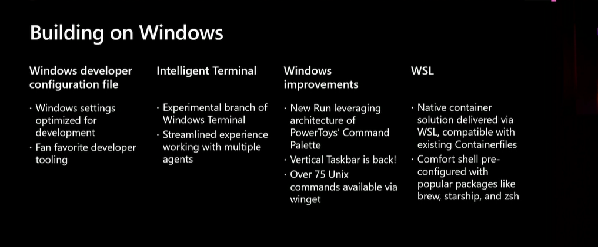

# Some talks from Build 2026 (June 2-3)

---

## What are we covering?

We'll cover parts of a few of the talks from Build.

---

I'll rush through these talks from the [YouTube playlist](https://www.youtube.com/playlist?list=PLlrxD0HtieHicIn65R7Oi_1nFXQr4SbtU):

- [.NET 11 in depth: Runtime, libraries, and SDK for the AI era](https://www.youtube.com/watch?v=-zAYZ7GSjAs)
- [Build and ship faster with a developer-optimized experience on Windows](https://build.microsoft.com/en-US/sessions/BRK261?source=sessions)
- [What we learned shipping VS Code weekly (without breaking everything)](https://www.youtube.com/watch?v=hH4RiA7pk5Q)

---

## .NET 11 in depth: Runtime, libraries, and SDK for the AI era

---

### SDK

UX

- dotnet run for MAUI (via devices) and aware of context (LLM support)
- work well with worktrees

Performance

- NAOT performance (bundled tools)
- multi-threaded MSBuild
- NAtive AOT-ified dotnet

Acquisition

- CLI based SDK/Runtime installation and maintenance (dotnetup)
- reducing the size of SDK install

---

### Libraries

- Process API
- Unicode (Rune awareness, emojis)
- System.Text.Json (JSONL)
- Compression

---

### Runtime Async

- opt-in for 11; likely default for 12
- no source code changes, completely compatible with compiler async

```xml
  <features>runtime-async=on</features>
```

- cleaner stack traces
- performance
- augtomatically get async improvements

---

### Memory safety

- two release project
- .net 11 reduce use of unsafe, and apply to CoreLib
- .net 12 Update rest of the product
- C# 16 redesings unsafe into a reviewable caller contract

---

Some JIT improvements

- see the SIMD improved code

---

## Build and ship faster with a developer-optimized experience on Windows

---

Powertoys/terminal/winget/wsl

- Building on windows
- Building for windows

---



---

A config for winget to get the PC into a standard configuration

https://github.com/microsoft/windowsdeveloperconfig

---

Insider program

- Taskbar personaliation
- New run dialog
  - takes after the powertoys command palette
- Intelliegent terminal ( https://github.com/microsoft/intelligent-terminal )

---

## WSL containers

wslc command line

why build container CLI?

There's an API too

[They want to make the API and the CLI work together]
[Open source and will push upstream]
--

## coreutils

https://github.com/microsoft/coreutils
75 difefrent tools

- test/tail/env

--

## Building on Windows

---

winappcli

https://github.com/microsoft/winappcli

Jump start building windows app - like publishing

---

Some skills too https://github.com/microsoft/win-dev-skills

---

Sample profile guided optimization

---

- Discusses instrumented code for profile guided optimization and the branch in the pipeline, and the friction this causes

- SPGO uses the hardware counters

- They have used this for Adobe photoshop

---

Will use a stack based VM to demo the improvement, calculating Fibonacci

---

Uses xperf to capture ETL traces around a run of the application

---

Now more on containers

WSL.Containers NuGet package and some in the project file

Will now build the containers as part of the publish

Runs in its own WSL VM - he shows the C# code that does this and the options you can set

---


