# Some talks from Build 2026 (June 2-3)

---

## What are we covering?

We'll cover parts of a few of the talks from Build.

---

I'll rush through these talks from the [YouTube playlist](https://www.youtube.com/playlist?list=PLlrxD0HtieHicIn65R7Oi_1nFXQr4SbtU):

- [.NET 11 in depth: Runtime, libraries, and SDK for the AI era](https://www.youtube.com/watch?v=-zAYZ7GSjAs)
- [Build and ship faster with a developer-optimized experience on Windows](https://build.microsoft.com/en-US/sessions/BRK261?source=sessions)
- [What we learned shipping VS Code weekly (without breaking everything)](https://www.youtube.com/watch?v=hH4RiA7pk5Q)

---

## .NET 11 in depth: Runtime, libraries, and SDK for the AI era

---

### SDK

UX

- dotnet run for MAUI (via devices)
- aware of context (LLM support, output formats)
- work well with worktrees

Performance

- Native AOT performance (bundled tools)
- multi-threaded MSBuild
- Native AOT-ified dotnet

Acquisition

- CLI based SDK/Runtime installation and maintenance (dotnetup)
- reducing the size of SDK install

---

### Simplifying .NET install using dotnetup

- [The design document](https://github.com/dotnet/designs/blob/main/accepted/2026/dotnetup/cli-acquisition-tool.md)
- [Video discussing it](https://youtu.be/eExkCpyUrrs?si=k_K6RZX4nvwDemyZ)

---

### Libraries

- Process API (avoid deadlocks, and allow easy connection using anynymous pipes)
- Unicode (Rune awareness, emojis)
- System.Text.Json (JSONL)
- Compression

---

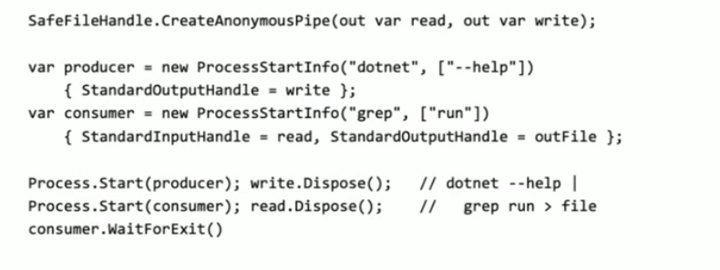

---

### Runtime Async

- opt-in for 11; likely default for 12
- no source code changes, completely compatible with compiler async

```xml
  <features>runtime-async=on</features>
```

[Design document](https://github.com/dotnet/runtime/blob/main/docs/design/specs/runtime-async.md)

---

- cleaner stack traces
- performance
- automatically get async improvements
- the frontend marks the methods
- the state machine is written by the JIT - shared with Native AOT

---

### Memory safety

- two release project
- .net 11 reduce use of unsafe, and apply to CoreLib
- .net 12 Update rest of the product
- C# 16 redesigns unsafe into a reviewable caller contract

---

### Some JIT improvements

- bounds check work

---

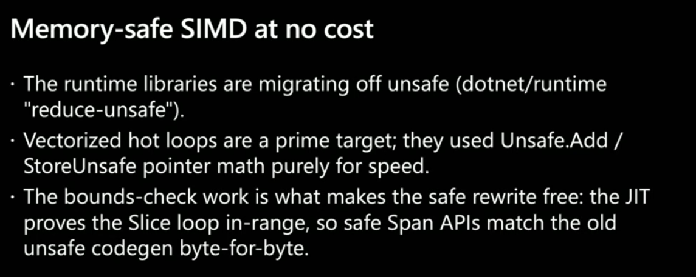

---

## Build and ship faster with a developer-optimized experience on Windows

---

### Powertoys/terminal/winget/wsl

- Building on windows
- Building for windows

---

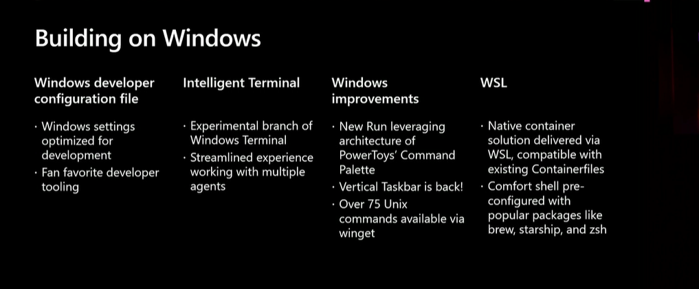

---

[A config for winget to get the PC into a standard configuration](https://github.com/microsoft/windowsdeveloperconfig)

---

### Insider program

- Taskbar personaliation (left/right/top/bottom)
- New run dialog - takes after the powertoys command palette
- [Intelligent terminal](https://github.com/microsoft/intelligent-terminal) has AI assistant in sub-pane

---

## WSL containers

```Powershell
C:\Users\clive.tong\Documents\git\Talks [main ≡ +2 ~1 -0 !]> wslc
Copyright (c) Microsoft Corporation. All rights reserved.
For privacy information about this product please visit https://aka.ms/privacy.

WSLC is the Windows Subsystem for Linux Container CLI tool. It enables management and interaction with WSL containers from the command line.

Usage: wslc  [<command>] [<options>]

The following commands are available:
  container  Manage containers.
  image      Manage images.
  network    Manage networks.
  registry   Manage registry credentials.
  settings   Open the settings file in the default editor.
```

---

- [Public preview](https://devblogs.microsoft.com/commandline/wsl-container-is-now-available-for-public-preview/)

---

[Failed if you have a . in your username](https://github.com/microsoft/WSL/issues/40944)

---

```Powershell
C:\Users\clive.tong\Documents\git> wslc run --rm hello-world
Image 'hello-world' not found, pulling
latest: Pulling from library/hello-world
4f55086f7dd0: Pull complete
Digest: sha256:c3cbe1cc1aa588a64951ac6286e0df7b27fe2e6324b1001c619bb358770c0178
Status: Downloaded newer image for hello-world:latest

Hello from Docker!
```

---

```Powershell
C:\Users\clive.tong\Documents\git\Talks\Build2026 [main ≡ +1 ~1 -0 !]> wslc container run --rm -it ubuntu:latest bash
Image 'ubuntu:latest' not found, pulling
latest: Pulling from library/ubuntu
ed819469700f: Pull complete
a3679419df18: Pull complete
Digest: sha256:3131b4cc82a783df6c9df078f86e01819a13594b865c2cad47bd1bca2b7063bb
Status: Downloaded newer image for ubuntu:latest
root@73a51ef5eac1:/#
```

---

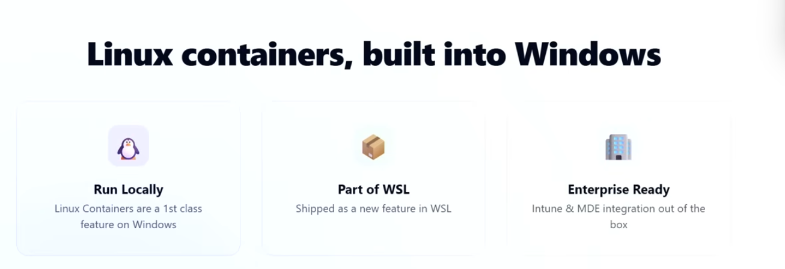

---

- They want to make the API and the CLI work together
- Open source and will push upstream
- Opinionated
- Extended with new commands

```Powershell
wslc system session list
```

---

[See this talk](WSL improvements and the new Containers CLI and APIs | DEM346)

---

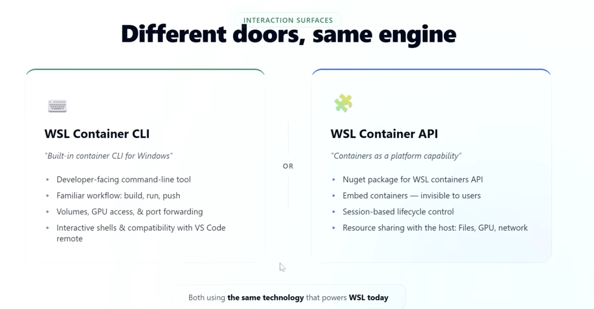

---

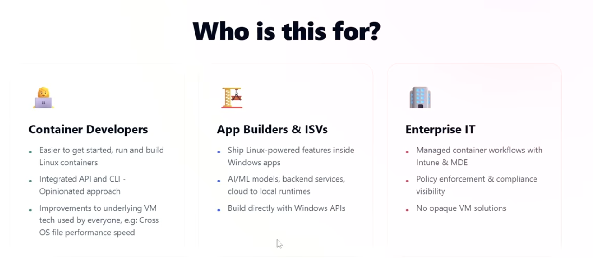

---

## coreutils

[70+ different tools](https://github.com/microsoft/coreutils)

```Powershell
C:\Users\clive.tong\Documents\git\Talks\Build2026 [main ≡ +1 ~1 -0 !]> ls 'C:\Program Files\coreutils\bin\' | wc -l
78
```

```Powershell
C:\Users\clive.tong\Documents\git> test -f .\counter.csv
C:\Users\clive.tong\Documents\git> $LASTEXITCODE
0
C:\Users\clive.tong\Documents\git> test -f .\counter2.csv
C:\Users\clive.tong\Documents\git> $LASTEXITCODE
1
```

- env

---

```Powershell
C:\Users\clive.tong\Documents\git\Talks [main ≡ +2 ~1 -0 !]> find . -iname "README.*" -exec grep -i dotnet "{}" ";" | tail -5
[The green threads write up](https://github.com/dotnet/runtimelab/blob/feature/green-threads/docs/design/features/greenthreads.md)
[A Microsoft bug that broke the profiler API](https://github.com/dotnet/runtime/pull/123564) by duplicating an event causing the simulated stack to underflow.
- [Different caller and callee saved registers](https://github.com/dotnet/runtime/blob/main/docs/design/coreclr/botr/clr-abi.md#register-values-and-exception-handling)
- [Access to locals because the frame pointer is set to that of the parent](https://github.com/dotnet/runtime/blob/main/docs/design/coreclr/botr/clr-abi.md#registers-on-entry-to-a-funclet)
- [GC Info and hot/cold splitting](https://github.com/dotnet/runtime/blob/main/docs/design/coreclr/botr/clr-abi.md#register-values-and-exception-handling)
```

---

## Building for Windows

---

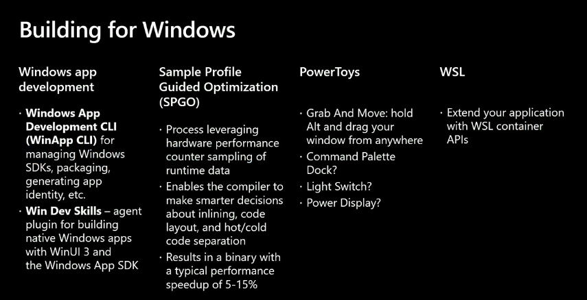

---

[winappcli](https://github.com/microsoft/winappcli)

Jump start building windows app - like publishing

---

[Some skills too](https://github.com/microsoft/win-dev-skills)

---

### Sample profile guided optimization

- Discusses instrumented code for profile guided optimization and the branch in the pipeline, and the friction this causes
- SPGO uses the hardware counters (and ETL events)
- They have used this for Adobe photoshop
- C/C++

---

- Will use a stack based VM to demo the improvement, calculating Fibonacci
- Uses xperf to capture ETL traces around a run of the application

---

[See learn](https://learn.microsoft.com/en-us/cpp/build/sample-profile-guided-optimization?view=msvc-170)

- Because SPGO profiles release bits instead of instrumented builds, it enables much more flexibility in where and how you collect data. You can gather runtime profiles from production servers, developer machines, performance labs, or any combination. The result is a binary that runs hot paths more efficiently, with a typical performance speedup of 5-15% depending on the quality of the profile data.

- Best candidates for SPGO: Large, branch-filled C/C++ applications with tight inner loops. Gains scale with codebase size and branch complexity. The small sample in this tutorial shows around 7% improvement. Larger production codebases often see more improvement.

---

### WSL containers integrated with build

- WSL.Containers NuGet package and some in the project file
- Will now build the containers as part of the publish
- Write C# code to start a Session and run the Linux container
- Runs in its own WSL VM

---

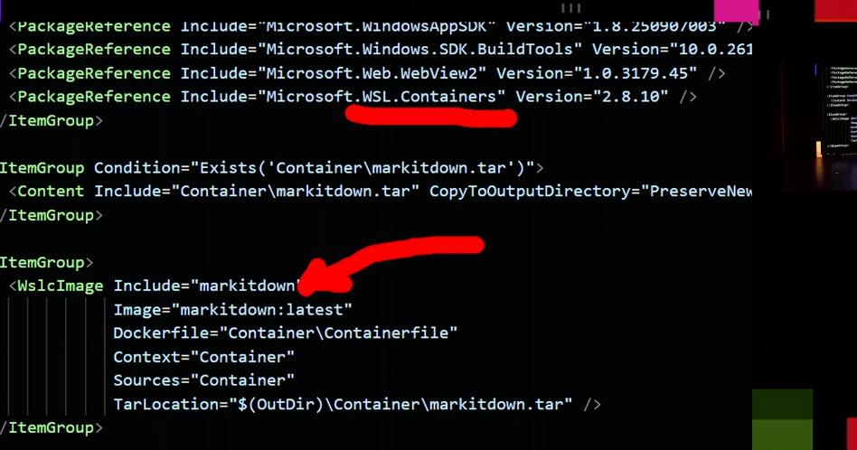

---

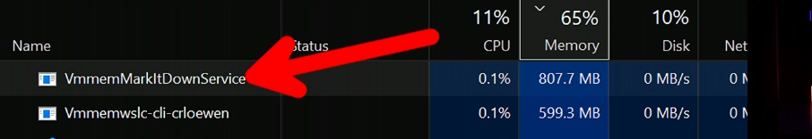

---

## What we learned shipping VS Code weekly (without breaking everything)

---

### How the team evolved as they ramped up the use of AI

- They adopted Agents, now what?
- AI changes how teams work, not just how they code

---

### Changes across

- Inner loop
- AI-native engineering system
- Planning and collaboration

---

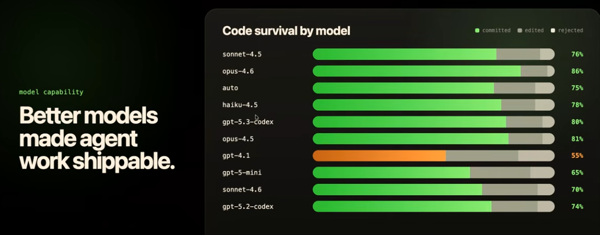

---

### After ten years, moved from monthly to weekly releases

- 3x more issues and PRs
- get smaller batches

---

### Developer inner loop

- Don't need to build whole product to test each PR
- Github Mobile App to read PR and see the UI changes that an Agent has put into it
- AI means you can test on Apple without having a Mac
- They extracted lots of components to allow them to be tested independent of the product
- Use the Agent to build prototypes

---

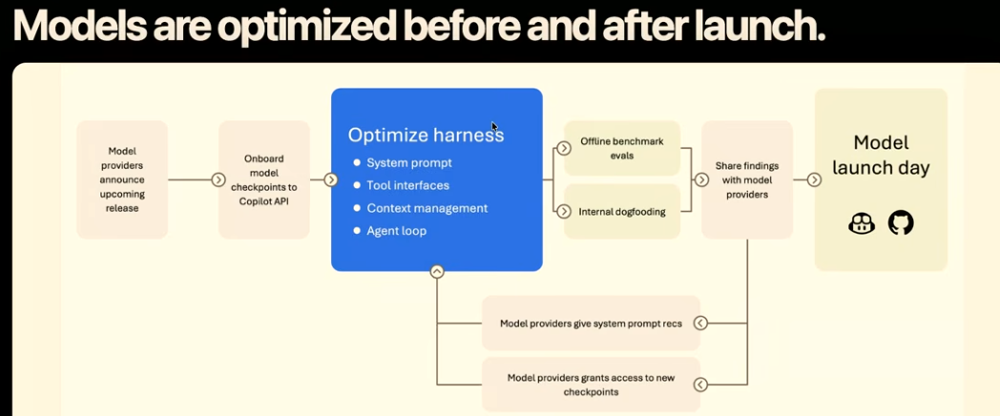

---

### AI-native teams need an AI-native engineering system

- lots of AI tooling using Agentic workflows
- model trained to infer owner of an issue

---

- Github events (issues and PRs etc)
- scheduled jobs (find an fix error with Errors Agent, de-duplicate issues)
- manual events (including chrome extension)

---

