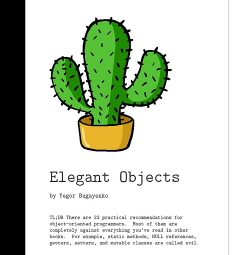

::: block
*Elegant Objects?* {style=background:red;width:500px}
:::

---

### [What's the talk about?](https://www.amazon.co.uk/Elegant-Objects-1-Yegor-Bugayenko/dp/1519166915/ref=sr_1_2?crid=3LS5PNBVLBTD5&keywords=elegant+objects&qid=1694173708&sprefix=elegant+objects%2Caps%2C68&sr=8-2)

---

TL;DR There are 23 practical recommendations for object-oriented programmers. Most of them are completely against everything you've read in other books. For example, static methods, NULL references, getters, setters, and mutable classes are called evil.

---

### [Elegant Objects](https://www.elegantobjects.org/)

Elegant Objects (EO) is an object-oriented programming paradigm that renounces traditional techniques like null, getters-and-setters, code in constructors, mutable objects, static methods, annotations, type casting, implementation inheritance, data objects, etc.

---

### So that all sounds quite extreme

And it's fair to say that the book is fairly critical of things we do in C# and Java every day.

It's a call to emphasise the object oriented part of the procedural/functional/OO languages we use today, but incorporating some more modern ideas since the SmallTalk days. 

---

### But this is more than observations

[There's a paper on the phi calculus](https://arxiv.org/pdf/2111.13384.pdf) which is a unified formalism for different OO languages.

It has some interesting properties like in-built decorators

It has some implementations [here](https://github.com/objectionary/eo) and [here](https://github.com/objectionary/eoc)

And papers are being produced and presented.

---

### So what kind of OO is this

- pure kind, with an emphasis on immutability
- no reference equality
- a primary constructor, with other secondary constructors chaining to it
- no use of `new` except in constructors
  - typically in the secondary constructors
- keep constructors code-free
- delay evaluation until it is needed 
  - declarative instead of imperative
- four public methods per class
- program to an interface

---

### So what kind of OO is this (cont)

- no mocks
  - provide stubs instead to your consumers
- no getters and setters
  - if you want a record, use a record
- methods are builders or manipulators
- no statics
- no exceptions
  - with a fail fast mentality
- never return NULL
- avoid type introspection and casting
- with an anthropomorphic mindset

---

### Primary and secondary constructors

<pre>
class Cash {
    private final int dollars;
    private final Exchange exchange;

    Cash() {
        this(0);
    }

    Cash(int value) {
        this(value, new NYSE());
    }

    Cash(int value, Exchange exch) {
        this.dollars = value;
        this.exchange = exch;
    }

    public int euro() {
        return this.exchange.rate("USD", "EUR") * this.dollars;
    }
}
</pre>

---

### Small objects with a clear purpose

<pre>
names = new Sorted(
  new Unique(
    new Capitalized(
        new Replaced(
            new FileNames(
                new Directory(
                    "/var/users/*.xml"
                )
            ),
            "([^.]+\\.xml)",
            "$1"
            )
        )
    )
);
</pre>

---

### Don't mock; use Fakes

If Exchange comes with a number of predefined fakes, 

<pre>
Exchange exchange = Mockito.mock(Exchange.class);
Mockito.doReturn(1.15)
  .when(exchange)
  .rate("USD", "EUR");
Cash dollar = new Cash(exchange, 500);
Cash euro = dollar.in("EUR");
assert "5.75".equals(euro.toString());
</pre>

\\/

<pre>
Exchange exchange = new Exchange.Fake();
Cash dollar = new Cash(exchange, 500);
Cash euro = dollar.in("EUR");
assert "5.75".equals(euro.toString());
</pre>

without me guessing what Cash is going to call.

---

### Decorate for performance

- write the implementation object
- if the method result is cacheable, then write a decorator that does this

---

[https://www.elegantobjects.org/](https://www.elegantobjects.org/)
