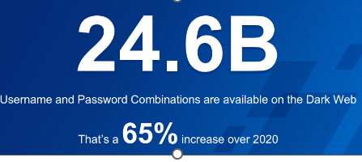
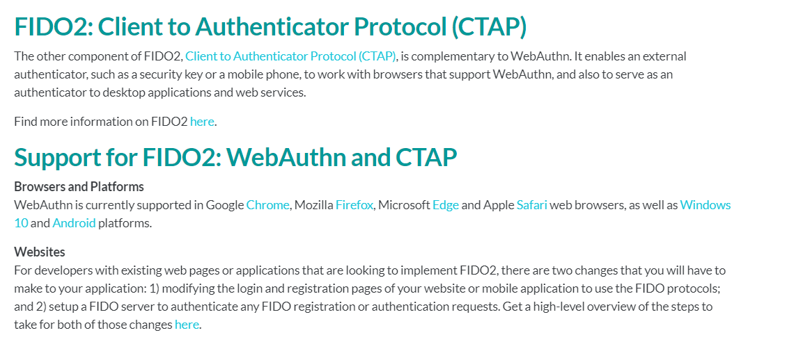

::: block
*What's FIDO about then?* {style=background:red;width:500px}
:::

---

---

### And I hadn't really heard about it at the time

- But passwords are dead

- SMS based MFA is breakable

- And we need a better form of MFA 
  - you and your YubiKey
  - you and your device

---

### [FIDO](https://fidoalliance.org/)

- Fast ID Online

---

### WHat is WebAuthN?

- Browser API for Passwordless Authentication

- Strong Authentication using Public Key Cryptography 

- A specification developed by W3C and FIDO Alliance

---

### [Three properties](https://webauthn.guide/)

- private key stored in hardware protected module

- a different private key per site

- attestation to prove th ekey is from the authenticator

---

---

### Try it at [webauthn.io](https://webauthn.io/)

- [when you register](https://stackoverflow.com/questions/73224907/what-information-does-fido2-url-contain-and-how-can-we-decode-it-in-swift)