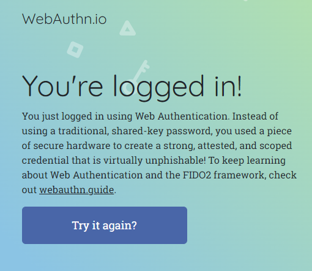

::: block
*What's FIDO about then?* {style=background:red;width:500px}
:::

---

### [FIDO](https://fidoalliance.org/)

- Fast ID Online

---

### What's the problem?

---

### But passwords aren't the future

- Passwords are dead

- SMS based MFA is breakable

- And we need a better form of MFA 
  - you and your YubiKey
  - you and your device

---

### What is WebAuthN?

- Browser API for Passwordless Authentication

- Strong Authentication using Public Key Cryptography 

- A specification developed by W3C and FIDO Alliance

---

### [Three properties](https://webauthn.guide/)

- private key stored in hardware protected module

- a different private key per site

- attestation to prove the key is from the authenticator

---

---

[The API is discussed here](https://webauthn.guide/#registration)
and [SimpleWebAuthn is here](https://simplewebauthn.dev/docs/simplewebauthn/philosophy)
This includes server [registration](https://simplewebauthn.dev/docs/packages/server#registration) and [authentication](https://simplewebauthn.dev/docs/packages/server#authentication) and the [browser side](https://simplewebauthn.dev/docs/packages/browser)

---

### Try it at [webauthn.io](https://webauthn.io/)

- Register
- Authenticate

- QR Codes
- Bluetooth between computer and external authenticator

---

---

---

- iPhone asks about keychain
- timeout if not quick enough

---

### What was that QR code?

- URL with FIDO protocol handler and base64 data

- [See this post](https://stackoverflow.com/questions/73224907/what-information-does-fido2-url-contain-and-how-can-we-decode-it-in-swift)

---

### Later logins

- and a biometric check

---

### And some advertising

---

### Problem solved!
