::: block
*WASM will disrupt your cloud via Golem* {style=background:red;width:500px}
:::

---

### What will we be talking about?

We'll focus on how WASM is being used in Golem cloud to make your cloud applications easier to write

---

### Some references

- Some of the material comes from [this talk at WASM I/O 2024](https://www.youtube.com/watch?v=fHPYetd3q2g) by John De Goes
- There's material on the Golem cloud blog about [Durable Computing](https://www.golem.cloud/post/what-is-durable-computing) and the [landscape](https://www.golem.cloud/post/the-emerging-landscape-of-durable-computing)
- Golem isn't the [only player in town](https://a16z.com/the-modern-transactional-stack/) - see for example [DBOS](https://www.golem.cloud/post/exploring-the-potential-of-stonebreaker-s-new-dbos)

---

### [Big Idea: much complexity stems from the fact that programs can fail half way through](https://www.youtube.com/watch?v=sDIXdVjJFN8&t=170s)

- Reliable, scalable, stateful, distributed systems need to account for (infrastructure) failure (for example, hardware failures/machine restarts/config changes/application code updates/network issues)
- This leads to complexity in applications which use patterns like event sourcing and use shared databases to store state
- Idempotency tokens and retries

---

Instead we'd rather have a program that is guaranteed to run to completion, leaving the business logic looking like you'd write it if failure never happened.

---

### [Durable computing in 4 phrases](https://www.golem.cloud/post/what-is-durable-computing)

- Invincible
- Failure and Recovery
- At Least Once
- Recovery latency

---

### Pushing the idea of Durable Workflows further

- there are things already that try to take the state machines away 

---

### Azure Durable Functions

- though alternatives like [Temporal.io](https://temporal.io/)

---

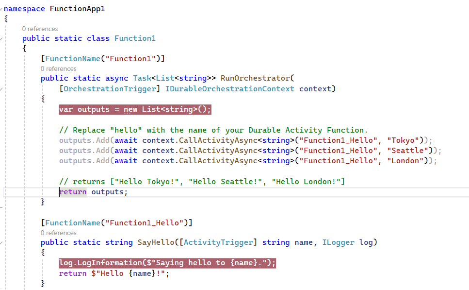

---

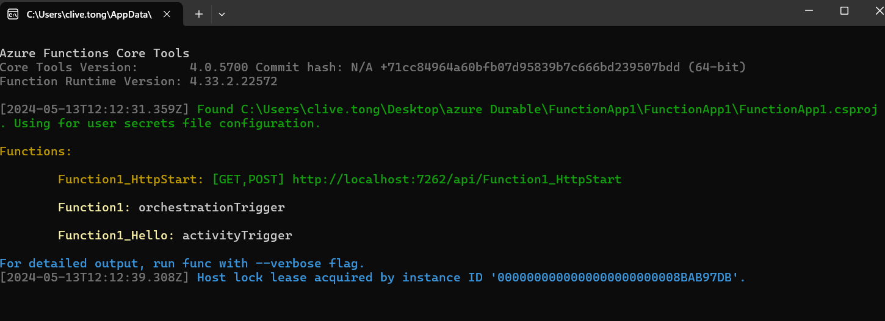

---

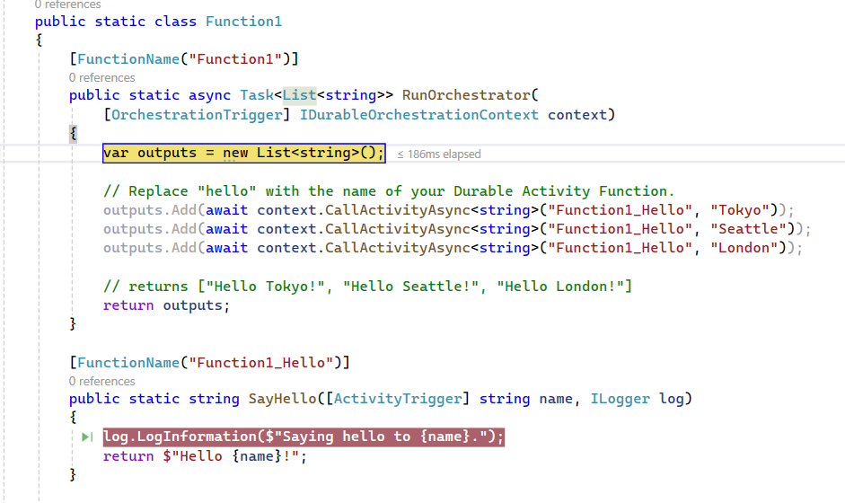

---

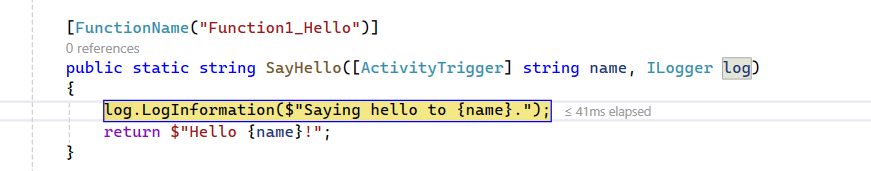

---

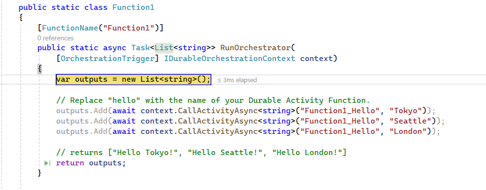

---

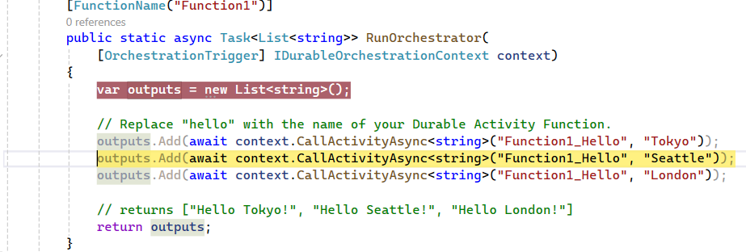

---

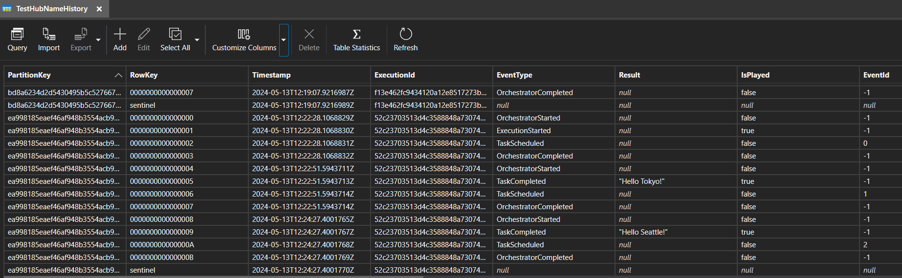

---

### Some Observations

- We're not back to clean business logic
- Durable state in Table Storage

---

Golem can do better!

---

### How do we implement this?

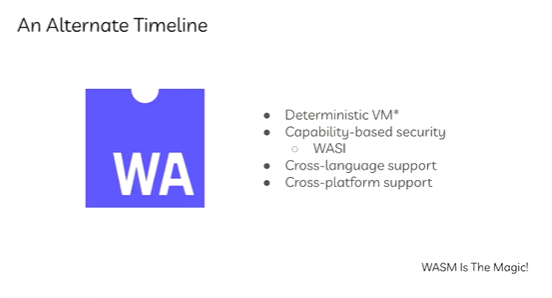

---

### With interception

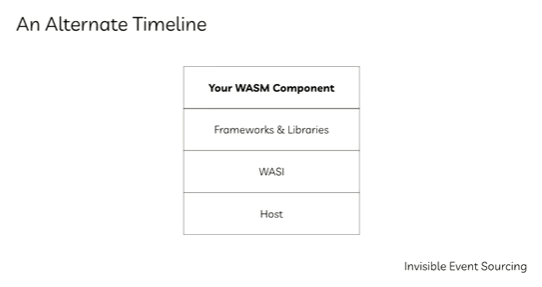

---

### Tell me more about WASM

- Many languages compile down to it
- There's a component model
- There's an interface specification language

- [dotnet](https://devblogs.microsoft.com/dotnet/extending-web-assembly-to-the-cloud/)

---

### Already used client side to variable success

- Blazor
- Mural
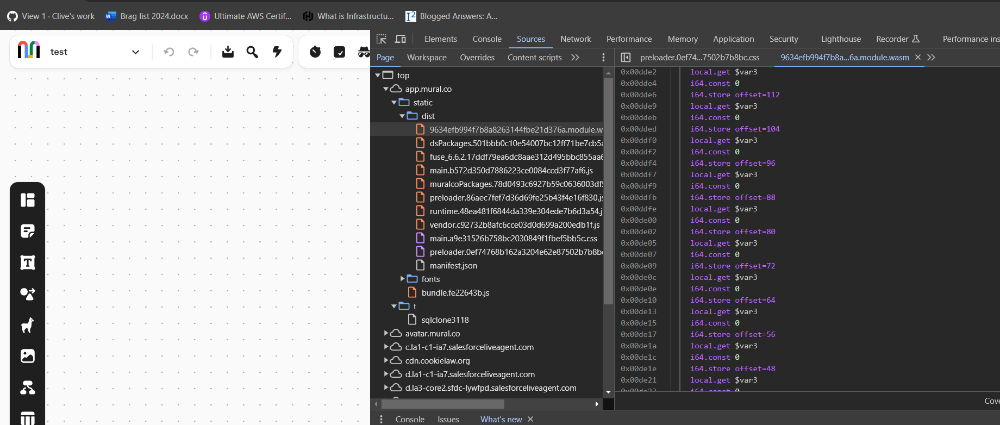

---

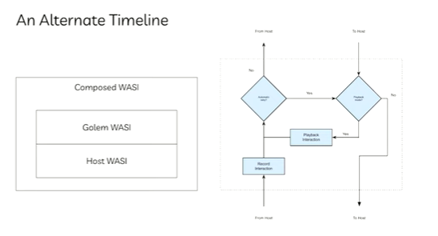

---

### Fabric of the Future

- Delete Event Sourcing
- Delete Databases
- Delete Kubernetes
- Delete Http/Json/GRpc

---

### The Shopping Cart Example

- [An example that just looks like a normal program](https://github.com/golemcloud/golem-examples/blob/main/examples/scala2/scala2-shopping-cart/src/main/scala/example/main.scala)

---

### More Links

- [Main repository](https://github.com/golemcloud/golem)
- [Examples](https://github.com/golemcloud/golem-examples)
- [Technical Details](https://learn.golem.cloud/docs/technical-details)
- [The WasmTime fork](https://github.com/golemcloud/wasmtime/tree/golem-wasmtime-17)
- [The WasmTime fork changes](https://github.com/bytecodealliance/wasmtime/compare/main...golemcloud:wasmtime:golem-wasmtime-17)
- [Watlings to understand more about the bytecode](https://github.com/EmNudge/watlings)
