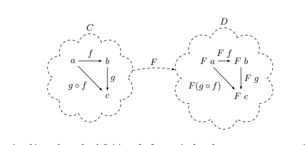

::: block
*Higher Kinds* {style=background:red;width:500px}
:::

---

### What's the talk about?

Category theory is a beautiful set of abstractions and associated theory that cover lots of areas of mathematics and computer science.
Haskell's types were heavily influenced by these ideas.
How far can we go with the ideas in C# (*)

Based on [some posts by Paul Louth](https://paullouth.com/higher-kinds-in-c-with-language-ext/) who re-implemented [his language-ext repo](https://github.com/louthy/language-ext) to use [`static abstract`](https://learn.microsoft.com/en-us/dotnet/csharp/language-reference/proposals/csharp-11.0/static-abstracts-in-interfaces) in interfaces.

(*) there will be few mentions of the m-word

---

### But really

There's a cool encoding of higher kinds into C# (with low overhead, and with a syntax that isn't too bad).

[There is some social media pushback against this though.](https://paullouth.com/are-higher-kinds-in-csharp-real/)

---

### Quick disclaimer

Haskell is a great language, but I think they overplay the "implements mathematical theories". To me, Haskell has based it's libraries in some of the types of category theory, but more as a pattern for its abstract datatypes.

[The romance of Haskell and Category Theory](https://www.reddit.com/r/haskell/comments/qqs2ur/the_romance_of_haskell_and_category_theory/)

[Is Hask even a category?](https://stackoverflow.com/questions/48485660/is-hask-even-a-category) and [Hask is not category](https://math.andrej.com/2016/08/06/hask-is-not-a-category/)

[Fast and Loose Reasoning is Morally Correct](https://www.cs.ox.ac.uk/people/jeremy.gibbons/publications/fast+loose.pdf)

---

### We'll look at Functors (disguised as Mappables)

See section 2 of [these notes](https://pages.cs.wisc.edu/~jcyphert/categoryTheoryNotes/basics/2_Functors.pdf)



- C,D ~ category of types (like Hask)
- a ~ String
- b ~ Int
- f ~ x => x.Length
- F ~ List, so F a ~ `List<string>`, F b ~ `List<int>`

---

### Why the rewrite?

[There is currently no way to abstract over static members and write generalized code that applies across types that define those static members. This is particularly problematic for member kinds that only exist in a static form, notably operators.](https://learn.microsoft.com/en-us/dotnet/csharp/language-reference/proposals/csharp-11.0/static-abstracts-in-interfaces)

---

### And the higher kinds?

In the C# `Type` everything is at a single level.

- `typeof(int)`
- `typeof(string)`
- `typeof(List<int>)`

And we can talk about uninstantiated parameters

- `typeof(List<>)`

But we can't track them in the type system

---

### So we'll need to use an encoding

- need the encoding to be low overhead at runtime
- need to compilation errors to be fairly easy to explain
- need to keep completion in the language server

---

### In more detail (but we'll look at the code)

---

We use an interface to represent Kinds

```Csharp
interface K<F,A>;
```

---

We'll type the Functor using this

```CSharp

public interface Mappable<F>
    where F : Mappable<F>
{
    public static abstract K<F, B> Select<A, B>(
                             K<F, A> list, Func<A, B> f);
}
```

---

*Singleton* classes to represent the unapplied type constructors

```Csharp
public class List : Mappable<List>
{
    public static K<List, B> Select<A, B>(
           K<List, A> list, Func<A, B> f) =>
                 list
                  .As()
                  .Items
                  .Select(f)
                  .ToArray();
}
```

---

### The *Singleton* means we can jump between C# types

```csharp
public static class ListExtensions
{
    public static List<A> As<A>(this K<List, A> ma) =>
        (List<A>)ma;
}
```

(But sadly you need to do it explicitly)

---

### But we already have collections and LINQ

Sort of - that's really because everything works in terms of `IEnumerable<T>`
