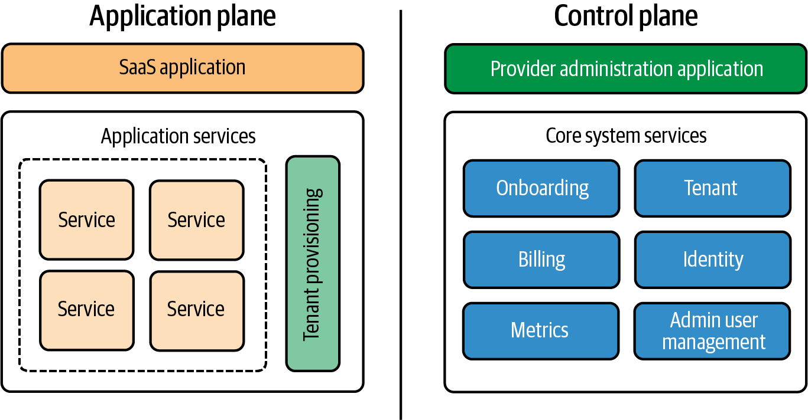
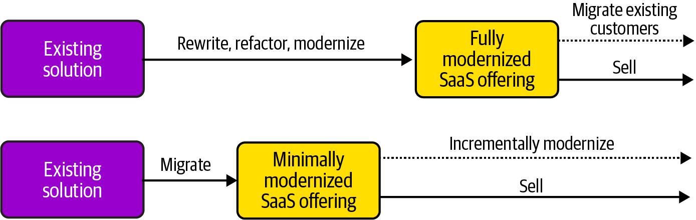

### How do you go about writing a SaaS Application?
  
---

You watch lots of videos and read the SaaS learning sections on the AWS and Microsoft web sites (see Resources)

---


[Here on O'Reilly learning](https://learning.oreilly.com/library/view/building-multi-tenant-saas/9781098140632/)

---

### What we'll cover

- The Theory Behind SaaS
- SaaS Architecture Fundamentals
- Deployment Models
- Some implementation Ideas (the tech stuff)
- Guiding Principles

---


[Image](https://learning.oreilly.com/library/view/building-multi-tenant-saas/9781098140632/ch01.html#fig_1_the_installed_software_model)

---

### What's wrong with these deployments?

- Customers with different versions
- Support always being "upgrade to latest"
- Bespoke versions of software
- Backdoor access to data repositories
- Snowflaking via tweaks

---

### The meaningless of "multi-tenant"

- We need a different language to talk about the sharedness and isolation of resources

---


[Image](https://learning.oreilly.com/library/view/building-multi-tenant-saas/9781098140632/ch01.html#fig_3_building_cross_cutting_saas_capabilities)

---



[Image](https://learning.oreilly.com/library/view/building-multi-tenant-saas/9781098140632/ch02.html#fig_4_saas_application_and_control_planes)

---

### The Control Plane

- The wrapper that lets your application code be application code
- Embed the application inside something that is generic and provides the other services
- Behind this barrier everything is taken care of for the customer

- (But the application isn't isolated and likely calls back to the control plane)

---

### Multi-tenancy


[Image](https://learning.oreilly.com/library/view/building-multi-tenant-saas/9781098140632/ch01.html#fig_5_multi_tenancy_with_shared_and_dedicated_resources)

---

[It should be clear that SaaS is very much about creating a technology, business and operational culture that is focused squarely on driving a distinct set of business outcomes. So, while it is tempting to think about SaaS though the lens of technology patterns and strategies, you should really be viewing SaaS more as a business model.](https://learning.oreilly.com/library/view/building-multi-tenant-saas/9781098140632/ch01.html#:-:text=By%20now%20you%20should,as%20a%20business%20model.)

---

### The SaaS Model offers

- Agility
- Operational Efficiency
- Innovation
- Frictonless Onboarding
- Growth

---

### In Summary

You are building a service and not a product.

---

Enough of the theory, back to the technology...

---

### What's a tenant?

- A logical entity that owns resources
- It will have many uses in the control plane

- Typically carried as part of the token on the request

SaaS identity == Identity + Tenant ID

---

### Architecture fundamentals

---

### The Control plane does (at least)

- Onboarding / Offboarding
- Identity
- Metrics
- Billing
- Tenant Management

---

### The Application plane does (at least)

- Tenant context
- Tenant isolation
- Data partitioning
- Tenant routing

---

### The Grey area

- Tiering
- Tenant/Tenant Admin/System Admin Users
- Tenant Provisioning

---

[The first hurdle I faced in this space was the absence of any precise terminology that accurately categorized the different patterns of multi-tenant deployments.](https://learning.oreilly.com/library/view/building-multi-tenant-saas/9781098140632/ch03.html#:-:text=The%20first%20hurdle,multi-tenant%20deployments.)

---

Resources like compute and storage can be independently pooled and siloed

---


[Image](https://learning.oreilly.com/library/view/building-multi-tenant-saas/9781098140632/ch03.html#fig_2_siloed_and_pooled_resource_models)

---

### Full Stack Silo

- Full stack silo can be a good first step

Siloed == for the use of the tenant, likely isolated via cloud provider, IAM and application code

---


[Image](https://learning.oreilly.com/library/view/building-multi-tenant-saas/9781098140632/ch03.html#fig_4_managing_and_operating_a_full_stack_silo)

---

### Comments on Full Stack Silo

- Scaling impacts
- Cost considerations
- Routing
- Availability and blast radius
- Simpler cost attribution
- Isolation is easy via accounts or VPCs

---

### Full stack pool

Share everything!

---


[Image](https://learning.oreilly.com/library/view/building-multi-tenant-saas/9781098140632/ch03.html#fig_7_a_full_stack_pool_model)

---

### And the flow of tenant context


[Image](https://learning.oreilly.com/library/view/building-multi-tenant-saas/9781098140632/ch03.html#fig_8_tenant_context_in_the_full_stack_pooled_environmen)

---

### Comments on Full Stack Pool

- Scale
- Isolation
- Availability and blast radius
- Noisy neighbour
- Cost attribution
- Operational Simplification

---

### Mixed Mode

Best of both worlds!

---


[Mixed Mode](https://learning.oreilly.com/library/view/building-multi-tenant-saas/9781098140632/ch03.html#fig_11_a_mixed_mode_deployment_model)

---

### Pod deployment

- Stamps

---

### Some Implementation Bits and Pieces

It's hard to put all that high level talk into practice, so let's have a look at some of the details in various places.

---

### [SaaS Identity](https://learning.oreilly.com/library/view/building-multi-tenant-saas/9781098140632/ch04.html#fig_9_creating_a_logical_saas_identity)

There's YOU and the context in which you are working

---


---


[Image](https://learning.oreilly.com/library/view/building-multi-tenant-saas/9781098140632/ch04.html#fig_11_adding_tenant_custom_claims_to_a_jwt)

---


[Image](https://learning.oreilly.com/library/view/building-multi-tenant-saas/9781098140632/ch04.html#fig_13_passing_tokens_to_downstream_microservices)

---

### Beware

- Use custom claims judiciously
- You can avoid adding to the token and just call a service to resolve

---


[Image](https://learning.oreilly.com/library/view/building-multi-tenant-saas/9781098140632/ch04.html#fig_15_supporting_externally_hosted_identity_providers)

---

### [Tenant Management](https://learning.oreilly.com/library/view/building-multi-tenant-saas/9781098140632/ch04.html#fig_15_supporting_externally_hosted_identity_providers)

---


[Image](https://learning.oreilly.com/library/view/building-multi-tenant-saas/9781098140632/ch05.html#fig_1_tenant_management_s_influence)

---


[Image](https://learning.oreilly.com/library/view/building-multi-tenant-saas/9781098140632/ch06.html#fig_7_a_sample_multi_tenant_authentication_flow)

---


[Image](https://learning.oreilly.com/library/view/building-multi-tenant-saas/9781098140632/ch06.html#fig_8_tenant_routing_basics)

---

### Implement how?

- Containers, possibly leading to Kubernetes
- Serverless

---


[Image](https://learning.oreilly.com/library/view/building-multi-tenant-saas/9781098140632/ch07.html#fig_8_compute_and_service_design)

---

### The Importance of Tenant Aware Metrics

---


[Image](https://learning.oreilly.com/library/view/building-multi-tenant-saas/9781098140632/ch07.html#fig_9_surfacing_tenant_aware_service_metrics)

---

### Getting Tenant information inside the application code

---

``` python
def query_orders(self, status):
  # get tenant context
  auth_header = request.headers.get('Authorization')
  token = auth_header.split(" ")
  if (token[0] != "Bearer")
    raise Exception('No bearer token in request')
  bearer_token = token[1]
  decoded_jwt = jwt.decode(bearer_token, "secret",
                   algorithms=["HS256"])
  tenant_id = decoded_jwt['tenantId']
  tenant_tier = decoded_jwt['tenantTier']
 
  # query for orders with a specific status
  logger.info("Finding orders with the status of %s", status)
```

---

Multi-tenant isolation happens via application code and via platform security mechanisms

- potentially using [sidecars](https://learning.oreilly.com/library/view/building-multi-tenant-saas/9781098140632/ch07.html#fig_12_using_sidecars_for_horizontal_concepts) or aspects

---

``` Python
def query_orders(self, status):
  # get database client (DynamoDB) with tenant scoped credentials
  sts = boto3.client('sts')
  
  # get credentials based on tenant scope policy
  tenant_credentials = sts.assume_role(
    RoleArn = os.environ.get('IDENTITY_ROLE'),
    RoleSessionName = tenant_id,
    Policy = scoped_policy,
    DurationSeconds = 1000
  )
  ...
```

---

### Data Partitioning

---


[Image](https://learning.oreilly.com/library/view/building-multi-tenant-saas/9781098140632/ch08.html#fig_1_siloed_and_pooled_data_partitioning_models)

---

- Blast Radius
- Isolation
- Operations
- Rightsizing
- Throughput and Throttling
- Serverless Storage

---

### More on Data Isolation

---


[Image](https://learning.oreilly.com/library/view/building-multi-tenant-saas/9781098140632/ch09.html#fig_4_categorizing_isolation_models)

---

- Application enforced isolation
- Infrastructure isolation
- Deployment time and runtime isolation
- Isolation through interception
- Scaling

---

### Have Enough Metrics to Attribute Costs

---


[IMage](https://learning.oreilly.com/library/view/building-multi-tenant-saas/9781098140632/ch12.html#fig_3_attributing_consumption_of_pooled_resources)

---

### Migration Strategies

---


[Image](https://learning.oreilly.com/library/view/building-multi-tenant-saas/9781098140632/ch13.html#fig_1_the_migration_balancing_act)

---



[Image](https://learning.oreilly.com/library/view/building-multi-tenant-saas/9781098140632/ch13.html#fig_2_migration_timing_trade_offs)

---


[Image](https://learning.oreilly.com/library/view/building-multi-tenant-saas/9781098140632/ch13.html#fig_3_the_migration_fish_model)

---

### Migration styles

- Silo lift and shift
- Layered migration
- Service-by-service migration

---


[Image](https://learning.oreilly.com/library/view/building-multi-tenant-saas/9781098140632/ch13.html#fig_5_silo_lift_and_shift_migration)

---

### Guiding Principles

- Build a Vision and a Strategy
- Focus on Efficiency
- Avoid the Tech-First Trap
- Think Beyond Cost Savings
- Be All-in with SaaS
- Adopt a Service Centric Mindset
- Think beyond existing Tenant Personas

---

### Core Technical Considerations

- No One-Size-Fits-All model
- Protect the Multi-Tenant Principles
- Build your Multi-tenant Foundation on Day one
- Avoid One-off customization
- Measure your Multi-Tenant Architecture
- Streamline the Developer Experience

---

### Resources

- [AWS SaaS Factory](https://aws.amazon.com/blogs/apn/introducing-aws-saas-factory-to-help-isvs-accelerate-saas-adoption/)
- [SaaS Factory Live](https://www.youtube.com/@saas-on-aws/streams)
- #sig-cloud from 11th March onwards

---

### And Microsoft's model

- [Microsoft Learn: SaaS and multitenant solution architecture](https://learn.microsoft.com/en-us/azure/architecture/guide/saas-multitenant-solution-architecture/) 
- [Azure SaaS Development Kit](https://github.com/Azure/azure-saas)
- [Microsoft SaaS academy](https://www.microsoft.com/en-us/saas-academy/main)

---
