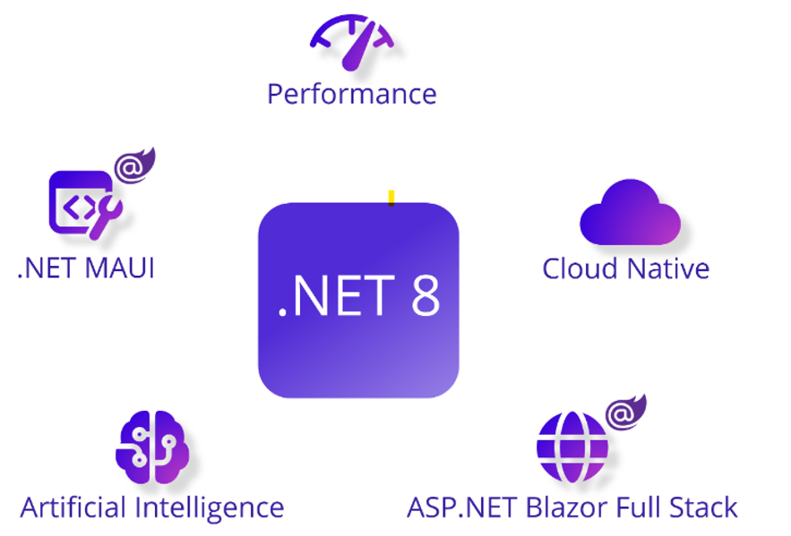
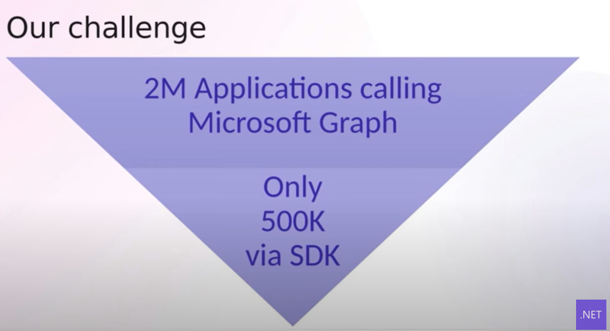
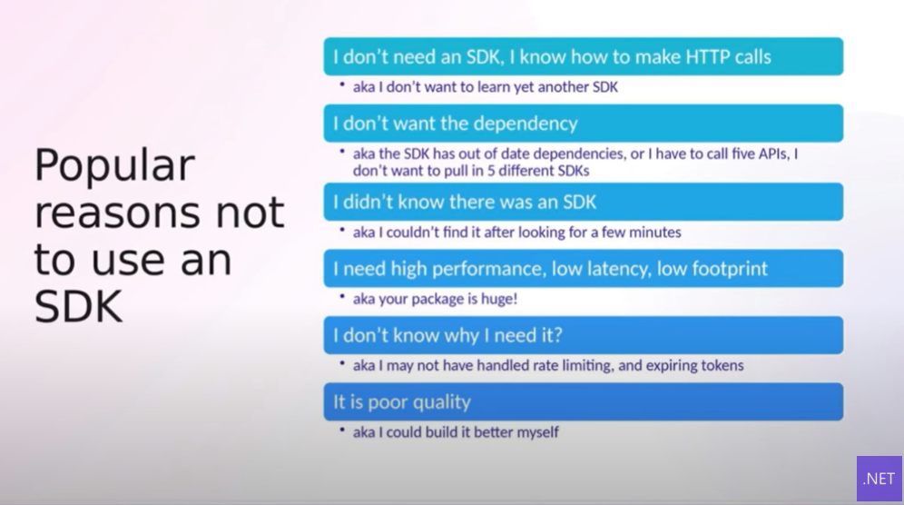
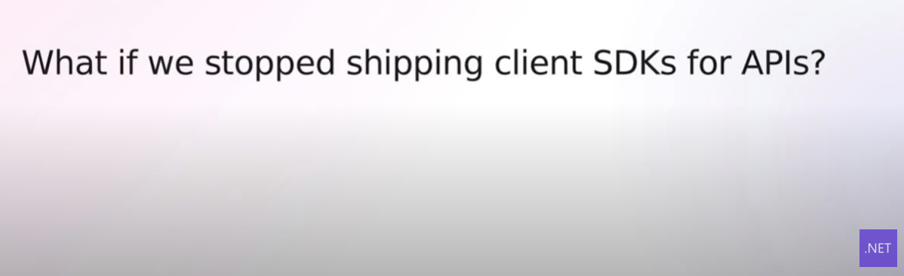
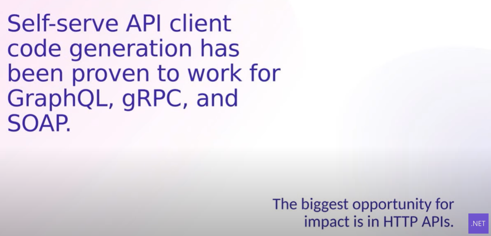
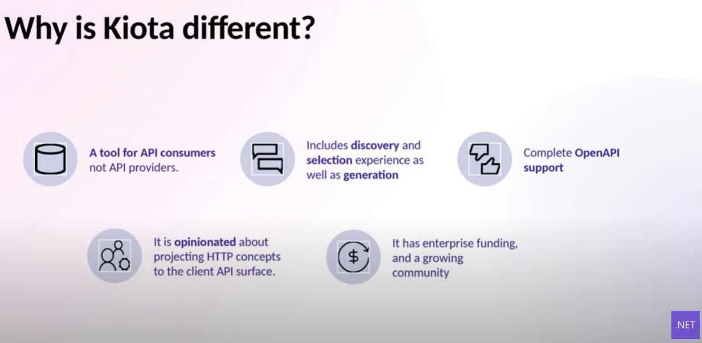

::: block
*Kiota* {style=background:red;width:500px}
:::

---

### [What are the changes in .NET 8?](https://devblogs.microsoft.com/dotnet/announcing-dotnet-8)




---

### My takeaways

- Some nice C# 12 features 
  - collection expressions, primary constructors

- Runtime improvements
  - DPGO (15% improvement), 
  - Stephen Toub blog post, 
  - WASM Jiterpreter, AOT (startup, container density) 

- Blazor
  - Server rendering, Enhanced navigation
  - Streaming rendering

---

### My takeaways (2)

- Aspire
  - Production ready observable distributed .NET applications

- Leverage AI
  - AI models, services and platforms through SDKs, Semantic Kernel

---

### [Kiota](https://github.com/microsoft/kiota)

- [See this quickstart](https://learn.microsoft.com/en-us/openapi/kiota/quickstarts/dotnet)

- [See the samples](https://github.com/microsoft/kiota-samples)

- And the .NET Conf Video
  - [Introducing project Kiota a client generator for OpenAPI](https://www.youtube.com/watch?v=sQ9Pv-rQ1s8) 

- Open source, not just source open

---



---



---



---



---



---

### Summarise!

- VS Code extension for discovery
- Partial generation from OpenAPI definition
- Supports .NET/Go/Python/TypeScript/Java/PHP

---

### Let's see it

```
dotnet tool install --global Microsoft.OpenApi.Kiota
```
```
kiota generate -l CSharp -c PostsClient -n KiotaPosts.Client
          -d ./posts-api.yml -o ./Client
```
```
--  Add some references
```
```
dotnet run
```

---

### And show the VSCode extension

