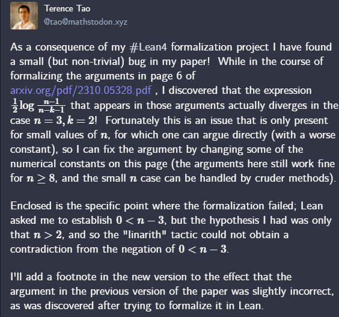

### [What's the talk about?](https://github.com/leanprover/lean4)

- Lean 4
  - a language and its runtime
  - Mathlib
  
---

### Augmented Mathematical Intelligence (AMI) at Microsoft

- Mission
  - Empower mathematicians working on cutting edge mathematics
  - Demoncratize math education
  - Platform for Math-AI research

---

### [And it is working](https://mathstodon.xyz/@tao/111287749336059662)



---

### And utilizing undergraduate

- Professor Kevin Buzzard at Imperial
- And his students
- Pushing [Mathlib](https://www.imperial.ac.uk/people/k.buzzard) onwards

---

[See Functional Programming in Lean](https://leanprover.github.io/functional_programming_in_lean/)

---

### What's new in Lean 4

- Entensibility: parser, elaborator, compiler, tactics, formatter, decision procedures
- Hygenic macro system
- Support for Language Server Protocol
- Compiler generates C code
- Runtime uses reference counting
- Functional But In Place (FBIP)
- Safe support for low-level tricks like equality
- Type class resolution

---

### Easy to use

- Trivial to use via a VS Code extension
- Installs everyting on first use
- Includes documentation

---

### Where can I see these examples?

- https://github.com/leanprover/lean4/blob/master/doc/examples/Certora2022

---

```lean
def main : IO Unit := IO.println "Hello world!"

#eval main
#eval "hello" ++ " " ++ "world"
#eval 1 :: [2,3,4]

#check true

def x := 10

#eval x * 2

def double (x : Int) := 2*x

#eval double 3
#check double

example: double 4 = 8 := rfl
```

---

```lean
def twice (f : Nat → Nat) (a : Nat) :=
  f (f a)

#check twice

#eval twice (fun x => x + 2) 10

theorem twice_add_2 (a : Nat) : twice (fun x => x + 2) a = a + 4 := rfl

#eval twice (· + 2) 10
```

---

```lean
inductive Weekday where
  | sunday | monday | tuesday | wednesday
  | thursday | friday | saturday

#check Weekday.sunday
-- Weekday

open Weekday
#check sunday

def Weekday.next (d : Weekday) : Weekday :=
  match d with
  | sunday    => monday
  | monday    => tuesday
  | tuesday   => wednesday
  | wednesday => thursday
  | thursday  => friday
  | friday    => saturday
  | saturday  => sunday

def Weekday.previous : Weekday → Weekday
  | sunday    => saturday
  | monday    => sunday
  | tuesday   => monday
  | wednesday => tuesday
  | thursday  => wednesday
  | friday    => thursday
  | saturday  => friday

theorem Weekday.next_previous (d : Weekday) : d.next.previous = d :=
  match d with
  | sunday    => rfl
  | monday    => rfl
  | tuesday   => rfl
  | wednesday => rfl
  | thursday  => rfl
  | friday    => rfl
  | saturday  => rfl

theorem Weekday.next_previous' (d : Weekday) : d.next.previous = d := by 
  cases d 
  rfl; rfl; rfl; rfl; rfl; rfl; rfl

```

---

### Dependent Types

```lean
def f (α β : Sort u) (a : α) (b : β) : α := a

#eval f Nat String 1 "hello"

def g {α β : Sort u} (a : α) (b : β) : α := a

#eval g 1 "hello"

def h (a : α) (b : β) : α := a

#check g
#check @g
#check @h
#check g (α := Nat) (β := String)

#check rfl
```

---

### Proof irrelevance

A proof is just a `Prop` for which you have constructed a member.

```lean
example: True ∧ True = True := by library_search

def OnePlusOneIsTwo : Prop := 1 + 1 = 2

theorem onePlusOneIsTwo : OnePlusOneIsTwo := rfl

def third (xs : List α) (ok : xs.length > 2) : α := xs[2]

#eval third [1,2,3,4,5] (by library_search)

```

---

```lean

#check 0
#check Nat
#check Type
#check Type 1
#check Eq.refl 2
#check 2 = 2
#check Prop

#check Π T : Prop, T 
#check Π T : Type, T
#check Π T : Type 1, T  
```

---

```lean
#print Nat 

def fib (n : Nat) : Nat :=
  match n with
  | 0 => 1
  | 1 => 1
  | n+2 => fib (n+1) + fib n

example : fib 5 = 8 := rfl

example : fib (n+2) = fib (n+1) + fib n := rfl

#print fib
```

---

### And a library of mathematical facts and definitions

```lean
#check Nat.
```

---

### With all kinds of proofs

```lean
def at_least_two_elems (A : Set ℕ) : Prop :=
  ∃ a b, a ∈ A ∧ b ∈ A ∧ a ≠ b

theorem example2 : at_least_two_elems {p : ℕ | Nat.Prime p} := by
  rw [at_least_two_elems]
  use 2, 3
  decide
```

---

[See Theorem Proving in Lean 4](https://lean-lang.org/theorem_proving_in_lean4/)

---
