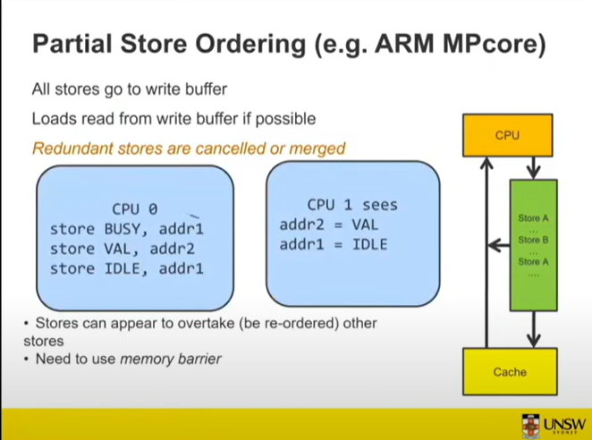

::: block
*The C# Memory Model* {style=background:red;width:500px}
:::

---

### Assembled material

- Some slides from [W08-a: SMP, Multicore, Memory Ordering and Locking](https://www.youtube.com/watch?v=luyj4biSAeM)
- [Memory Barriers: a Hardware View for Software Hackers](http://www.rdrop.com/~paulmck/scalability/paper/whymb.2010.06.07c.pdf)
- [The C# memory model](https://github.com/dotnet/runtime/blob/main/docs/design/specs/Memory-model.md#net-memory-model)
- [The issue to define a better memory model](https://github.com/dotnet/runtime/issues/79764)
- [Questions about whether the JIT obeys them](https://github.com/dotnet/runtime/pull/75790#issuecomment-1354408347) and [here](https://github.com/dotnet/runtime/issues/6280)
- [MSDN article on the old ECMA model](https://learn.microsoft.com/en-us/archive/msdn-magazine/2012/december/csharp-the-csharp-memory-model-in-theory-and-practice) and [part two](https://learn.microsoft.com/en-us/archive/msdn-magazine/2013/january/csharp-the-csharp-memory-model-in-theory-and-practice-part-2)
- [The best book on this topic, for Rust](https://marabos.nl/atomics/memory-ordering.html)

---

### Assembled material (cont)

- [The OCaml memory model](https://ocaml.org/manual/5.3/memorymodel.html#sec92)
- [A talk on the ARM model](https://www.youtube.com/watch?v=2I8OHacills)
- [Is Parallel Programming Hard](https://www.kernel.org/pub/linux/kernel/people/paulmck/perfbook/perfbook.html)

---

### What are we covering?

How can you be sure of the observed behaviour of your multi-threaded code (by another thread)

- where this observation is of the changes to memory as the other thread sees it

---

### What is a memory model?

A contract between the language platform and the writer of code that tells them what guarantees they have

---

### Why is it interesting (to me)?

It lies at the intersection of hardware and software, requiring guarantees from:

---

- the hardware
  - processor
    - pipelines
    - store buffers
    - invalidation queues
    - bus snooping and directory protocols across interconnects (cache coherency)
    - speculative execution
    - micro-ops (Intel ie assembly is just the instructions of another virtual machine)
    - superscalar
    - [register renaming](https://en.wikipedia.org/wiki/Tomasulo%27s_algorithm)

---

- the hardware (cont)
  - MMU
  - DMA
- the operating system
- the compiler and JIT
- the runtime libraries

---

### [Why doesn't the hardware just get things right?](https://www.youtube.com/watch?v=luyj4biSAeM)

- So Intel does go some way to doing this, but it costs space on the die and performance


---

### So what's the state of play?

- Newer architectures instead optimize for single threaded code where the CPU guarantees that you observe things in program order

- [Amdahl's law](https://en.wikipedia.org/wiki/Amdahl%27s_law)

- when you need to guarantee the observations cross cores then you are likely to synchronize using program level locks

- if you don't want to lock, you'd better understand the memory model

---

### Symmetric Multiprocessing


---

### Cache coherency


---

### Sequential consistency

[It is the property that "... the result of any execution is the same as if the operations of all the processors were executed in some sequential order, and the operations of each individual processor appear in this sequence in the order specified by its program."](https://en.wikipedia.org/wiki/Sequential_consistency)

---

### Write-through caches


---


---

### MESI


---

### I find it fascinating that we write

- message passing systems
- on top of a procedural language
- that runs on hardware that passes cache lines around like messages

---


---


---

And we need directory protocols to work between the subsystems

---


---

We managed to keep sequential consistency, but gave up some performance.

Notice this slows things down to the speed of main memory!

And we'd like the processor running sequential code to go faster.

---

### All good - not quite!

```csharp
# We've taken the lock exclusively setting mutex to 1

#increment counter
load r1, counter
add r1, r1, 1
store r1, counter

# release the lock
store zero, mutex
```

We want other cpus to see the counter increment before the lock is released.

---

### Strong ordering

Assume X = Y = 1

```csharp
cpu1

store 1, X
load r2, Y
```

and

```csharp
store 1, Y
load r2, X
```

---


---


---

### Total Store Order (x86)

Guarantee to see the updates in FIFO order, so the lock example is fine.

But the order example fails with X = Y = 0

---


---

### Not always single instructions


---

### Partial Store Order



ie stores get overwritten or elided

---


---


---

Not just data, can be instructions and TLB too
 
---

### So this is all about ARM?

- Maybe.

- .NET Framework gave a very weak memory model (not many guarantees)
  - ECMA-334 (and Duffy's book [Concurrent Programming on Windows](https://learning.oreilly.com/library/view/concurrent-programming-on/9780321434821/) 2008)
  - volatile had a meaning very similar to old C, with device memory ideas

---

- .NET Core designed for modern platforms (ARM)
  - but can't expect people to get the code right without help, so make [the memory model much stronger](https://github.com/dotnet/runtime/blob/main/docs/design/specs/Memory-model.md)!
  - Don't make it too strong
    - so no sequential consistency

---

### [ECMA 335 vs. .NET memory models](https://github.com/dotnet/runtime/blob/main/docs/design/specs/Memory-model.md#ecma-335-vs-net-memory-models)

ECMA 335 standard defines a very weak memory model. After two decades the desire to have a flexible model did not result in considerable benefits due to hardware being more strict. On the other hand programming against ECMA model requires extra complexity to handle scenarios that are hard to comprehend and not possible to test.

---

In the course of multiple releases .NET runtime implementations settled around a memory model that is a practical compromise between what can be implemented efficiently on the current hardware, while staying reasonably approachable by the developers. This document rationalizes the invariants provided and expected by the .NET runtimes in their current implementation with expectation of that being carried to future releases.

---

### What do the following programs do?

---

```csharp
Task.Run(() => { while (true) { counter++; } });

while (true)
{
  Console.WriteLine(counter);
}
```

Do I only see the values going up?

---

Yes, though the Console.WriteLine could move across cores at the whim of the observations

---

```csharp
static bool flag;

static void Main(string[] args)
{
  Task.Run(() => flag = true);

  while (!flag)
  {
  }

  System.Console.WriteLine("done");
```

---

```csharp
  while (!Volatile.Read(ref flag))
```

---

```csharp
void ThreadFunc1() { while (true) { obj = new MyClass(); } }

void ThreadFunc2() { while (true) { obj = null; } }

void ThreadFunc3()
{
    MyClass localObj = obj;
    if (localObj != null)
    {
        System.Console.WriteLine(localObj.ToString());
    }
}
```

---

### ... accessing members of the local object is safe because

- reads cannot be introduced, thus localObj cannot be re-read and become null
- publishing assignment to obj will not become visible earlier than write operations in the MyClass constructor
- indirect accesses via an instance are data-dependent reads, thus we will see results of constructor's writes

---

### Key remarks from the new memory model

---

### [Atomic memory accesses](https://github.com/dotnet/runtime/blob/main/docs/design/specs/Memory-model.md#atomic-memory-accesses)

- aligned memory reads are atomic as are `System.Threading.Interlocked` methods and `System.Threading.Volatile` methods

---

### [Side-effects and optimizations of memory accesses](https://github.com/dotnet/runtime/blob/main/docs/design/specs/Memory-model.md#side-effects-and-optimizations-of-memory-accesses)

- Speculative writes are not allowed.
- Reads cannot be introduced.
- Unused reads can be elided. (note: if a read can cause a fault it is not "unused")
- Adjacent non-volatile reads from the same location can be coalesced.
- Adjacent non-volatile writes to the same location can be coalesced.

---

### [Cross-thread access to local variables](https://github.com/dotnet/runtime/blob/main/docs/design/specs/Memory-model.md#cross-thread-access-to-local-variables)

- There is no type-safe mechanism for accessing locations on one thread’s stack from another thread.

---

### [Order of memory operations](https://github.com/dotnet/runtime/blob/main/docs/design/specs/Memory-model.md#order-of-memory-operations)

- The effects of ordinary reads and writes can be reordered as long as that preserves single-thread consistency. Such reordering can happen both due to code generation strategy of the compiler or due to weak memory ordering in the hardware.

- Volatile reads have "acquire semantics" - no read or write that is later in the program order may be speculatively executed ahead of a volatile read.

---

- Volatile writes have "release semantics" - the effects of a volatile write will not be observable before effects of all previous, in program order, reads and writes become observable

- Note that volatile semantics does not by itself imply that operation is atomic or has any effect on how soon the operation is committed to the coherent memory. It only specifies the order of effects when they eventually become observable.

---

- Full-fence operations have "full-fence semantics" - effects of reads and writes must be observable no later or no earlier than a full-fence operation according to their relative program order. 
Operations with full-fence semantics: `System.Thread.MemoryBarrier` and `System.Threading.Interlocked` methods

---

### Do I need to care?

- Probably not - you should be using higher level constructs rather than caring about the observability of field writes from other threads
- lock-free and synchronization free is probably not buying you anything in terms of perf
  - an uncontended lock  is 10s of nanoseconds

---

- `lock` is really important as it lets you assert an invariant at start and end, and stops others working when the invariant isn't holding
  - recursive locks on windows are easy to get wrong 
  - lock levelling to avoid deadlocks
- use in-built concurrency primitives like `lazy` - those are reasoned about by experts and have massive soak tests to check them
- [structured concurrency is the future](https://en.wikipedia.org/wiki/Structured_concurrency)

---

### Quick remarks

- Back in the day, one expressed locks in shared memory concurrency using [Dekker's Algorithm](https://en.wikipedia.org/wiki/Dekker%27s_algorithm) and [Peterson's algorithm](https://en.wikipedia.org/wiki/Peterson%27s_algorithm)
- sequential consistency meant that you could handle concurrency just in the language
- We then moved to needing `volatile`
- We've now moved more to needing to understand the memory model and library features to ensure correctness
