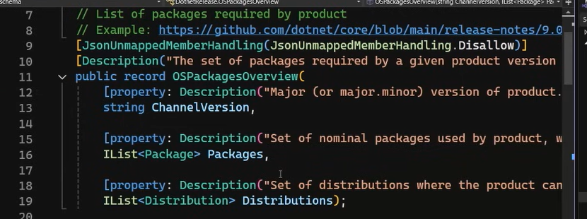

::: block
*.NET Conf 2024 Recap* {style=background:red;width:500px}
:::

---

### What's the talk about?

We're going to look at some of the runtime, libraries and languages talks from .NET Comnf 2024, and talk through some of the highlights.

---

These are the talks from the [playlist](https://www.youtube.com/playlist?list=PLdo4fOcmZ0oXeSG8BgCVru3zQtw_K4ANY):

- [What's new in the .NET Runtime, Libraries, & SDK](https://www.youtube.com/watch?v=4iEqqPZKDC0)
- [Performance Improvements in .NET 9](https://www.youtube.com/watch?v=aLQpnpSxosg)
- [C#'s Best features you might not be using](https://www.youtube.com/watch?v=yuXw7oj0Bg0)
- [New Features in the .NET 9 JIT](https://www.youtube.com/watch?v=1bsTnaLchi4)

---

### What's new in the .NET Runtime, Libraries, & SDK

---

### Server GC less aggressive in taking memory

In practical terms, .NET 8 has a bias to starting off big and .NET 9 is the opposite.


- there is more bookkeeping
- can configure Server GC to still use old algorithm

---

### RyuJIT and Profile Guided Optimization

"The .NET re-compiler"

- DPGO has fast path and common path
- focus this time on casts and loops (strength reduction, induction variable widening)

---

### The Host

"myapp.exe"

Enabled control-flow enforcement technology by default on windows.

- Hardware protection againt ROP (Return Oriented Programming)
- small cost but recommended

---

### .NET Install Search Behaviour

Previously deploy self-contained apps, but not can have multiple apps sharing a framework install


###

- Lots of "spanification" (with .AsSpan())
- Avoids allocations of things like strings which can make a perf difference
- But how do we use spans for lookups

---

### Alternate Lookup


---

Debug.Assert tells you what failed

Using a combination of CallerArgumentExpression and OverloadResolutionPriority

---

Linq Index expression for ForEach

```CSharp
foreach(var (index,persion) in people.Index())
```
---


---

JSONSchemaExporter from C# to JSON Schema `JSONSchemaExporter`

TransformSchemaNode to adjust types.
No runtime support to check the compliance yet



---

BinaryFormatter is gone!

unsupported Compat package is bring back the functionaliy

---

Package vulnerability auditing now does transitive dependencies

So expect more warnings when restoring

Some System.* packages have false positives

---

Terminal Logger has pretty colours and pretty summaries

---

dotnet tool install --allow-roll-forward ...

dotnet tool run --allow-roll-forward ...

Tools a special kind of NuGet package

Currently bound to a .NET version

---

dotnet publish can now publish to insecure (http) registries


---

*****************

---

### Performance Improvements in .NET 9

---

*****************

---

### C#'s Best features you might not be using

---

High bar for backwards compatibility

Some things for the last few releases

- Pattern matching
- File scoped namespaces
- Init and required
- String literals
- Records
- Collection Expressions

---

### Pattern Matching

Express your intent

Switch expressions give warning if all values not matched. Also if a pattern is redundant.


Bug in the second method - subsumed warning soon

---

### File scoped namespaces

Remove a complete layer of indent

Turn off whitespace diff when comparing

---

### init and required

Makes the intent clearer, and avoids the nullable warning


---

### Strings

- quoted
- verbatim
- interpolated
- raw

---


3 or more quotes needed

whitespace ignored on first line and up to indent of the closing

---


---


Note double brackets to avid clash with JSON bracket (and the double $)

---

### Records

A single approach for data oriented types

- Correct and fast equality
- Withers - non-destructive mutation
- Readable consistent ToString() output
- Concise declaration
- Both struct and class records
- Synthesises several members for correctness and performance

---

[See a Sharplab decompilation](https://sharplab.io/#v2:D4Jwpgxg9iAmAEBhArgZwC5QLZhACgAEBGABngDsBDHASgG4g===)

---

### Primary contructors

Parameters converted to public fields

---

### Collection Expressions


---


---

*****************

---

### New Features in the .NET 9 JIT

---


---


---

### Object stack allocation

If escape analysis proves that the lifetime is constrained by the lifetime of the stack frame, then allocate of the stack

- possibly field promotion
- aggressive optimization 

(see example in talk of allocating a rectangle, and everyting is optimized away)

---

### Cobalt-100 on Azure

See the [article](https://learn.microsoft.com/en-us/azure/virtual-machines/sizes/cobalt-overview)

Check ARM based machine for your workloads

Offers SVE extension and the JIT can use them in some loops for vector processing.


---

### Jitted code

Fewer instructions, and use of fewer registers

---

### DPGO

- .NET 8 DPGO was about virtual calls and interface calls

- .NET 9 extend to casting

[Tier 0 watches for the common types in the cast, and then optimze for this case]

---

### Inlining

Inlining for shared generics


---

~1100 changes to the codegen between .NET 8 and .NET 9

All of the improvements are yours automatically
