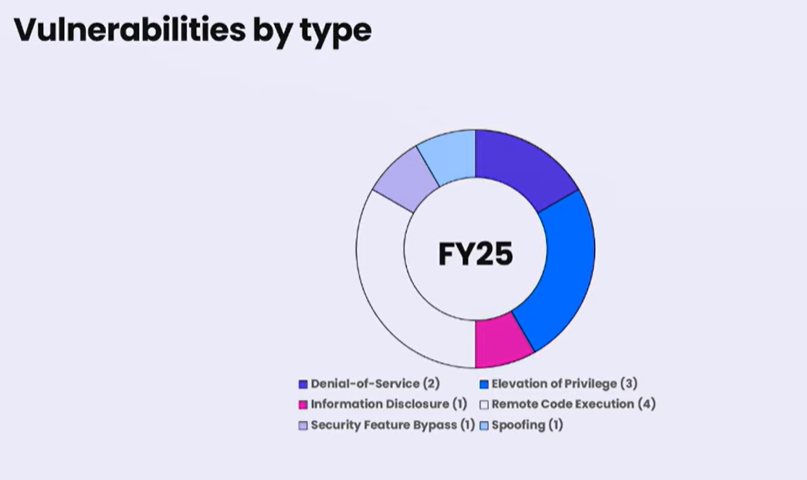
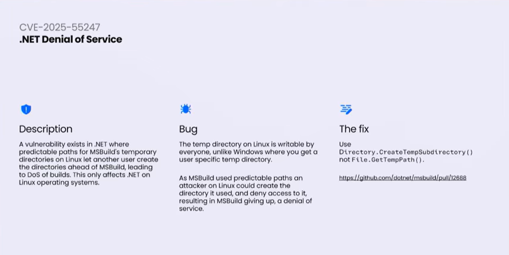
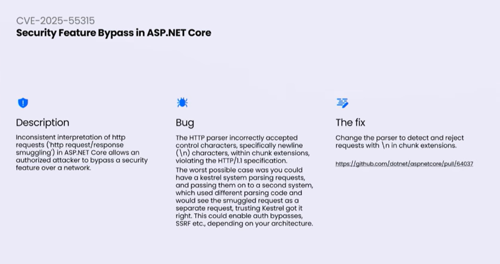

::: block
*.NET Conf 2025 Recap* {style=background:red;width:500px}
:::

---

### What are we covering?

We're going to look at three sessions from the recent .NET Conf 2025 - one on performance, one on Aspire (not ~~.NET~~ Aspire) and one on security - and point out some of the things I thought were interesting.

---

These are the talks from the [playlist](https://www.youtube.com/playlist?list=PLdo4fOcmZ0oXtIlvq1tuORUtZqVG-HdCt):

- [Performance Improvements in .NET 10](https://www.youtube.com/watch?v=snnULnTWcNM)
- [Aspire Unplugged with David and Maddy](https://www.youtube.com/watch?v=dJdXdRiIfDw)
- [A Year in .NET Security (2024–2025)](https://www.youtube.com/watch?v=8lFm4wI1bPo)

---

## Performance Improvements

---

### Some relevant issues here

- [Deabstraction issue](https://github.com/dotnet/runtime/issues/108913)
- [Some design notes](https://github.com/dotnet/runtime/blob/main/docs/design/coreclr/jit/DeabstractionAndConditionalEscapeAnalysis.md)
- [Support for devirtualizing array interface methods](https://github.com/dotnet/runtime/pull/108153)

---

### De-abstraction

- Bring together previous work and extend it!
- Show the array example and the front end work (sharplab.io)
- Show the cost of using IEnumerable<>

---

### Here's an example

- Show the test3 example

```Csharp
  dotnet run -c Release -f net48
  dotnet run -c Release -f net9.0
  dotnet run -c Release -f net10.0
```

---

- Stack allocation via better escape analysis
- GDV (guarded devirtualization)
- PGO improvements
- Inlining improvements

---

### Stack allocation

```CSharp
int Test()
{
    var inst = new Number(20);
    return inst.x;
}

record class Number(int x);
```

---

- Mention Go and it's reverse use of escape analysis

---

### GDV

```CSharp
int Test(IFoo target) => target.Call();

interface IFoo { int Call(); }
class A : IFoo { public int Call() => 42; }
```

compiles as

```CSharp
int Test(IFoo target) =>
  target.GetType() == typeof(A)
  ? 42
  : target.Call();
```

---

### We used heuristics to decide to do it

```CSharp
int Test(IFoo target) 
{
  // Record count of the instance types
  // When we have enough data, trigger a recompliation
  target.Call();
}
```

---

### And see that in practice

```CSharp
$env:DOTNET_JitDisasm="<<Main>$>g__Test3|0_2"
```

---

### Lots of the benefits were inlining

- Function calls have an overhead
- We can see through to what is actually happening

---

### What does it mean for me?

- I think it is hard to correctly grasp the cost model
- Particularly, as decisions are heuristics and may change over time

---

### Improved many collection types

- Stack<>
- Queue<>
- ConcurrentDictionary<,>
- Improved the enumerators but also lots more

---

### Call out to CollectionsMarshal

- to get to the underlying data structure

```CSharp
List<int> x = [ 1, 2, 3, 4, 5 ];
var data = CollectionsMarshal.AsSpan(x);
```

---

### LINQ

---

### Some relevant LINQ issues here

- [Ad hoc improvements](https://github.com/dotnet/runtime/issues/100378)

---

```CSharp
Enumerable.Range(0,100).OrderBy(x => -x).First()
```

---

- We don't really need to sort
- ... and SqlMonitor and MaxBy
- From .NET Core 3, they've passed information between the query operators ie not really implemented as a pipeline steps

---

### Extended these optimizations

```CSharp
Enumerable.Range(0,100).OrderBy(x => -x).Contains(42)
```

---

```CSharp
Enumerable.Range(0,100).Reverse().Contains(42)
```

---

### Again, it leaves the cost model hazy IMHO

---

### Regular expressions engine

- Toub uses the source code that the RegExp source generator outputs (added in .NET 7)
- Greedy loops and backtracking - better recognising when backtracking won't help (atomic)
- Remove unnecessary work

---

## Aspire Unplugged with David and Maddy

---

### How did it all start?

- Xmas break project for five people.
- What is the hardest part of developing and deploying cloud apps?
- Decided "Human writes and maintains a lot of scripts" - model in something with more structure to enable tooling
- The human orchestrates the yaml for cloud, and docker compose file for local dev and lots of other scripts

---

### Project Tye

- [Project Tye announcement](https://devblogs.microsoft.com/dotnet/introducing-project-tye/)
- [Project Tye repository](https://github.com/dotnet/tye)

---

### Aspire

- Ideas from Tye, Kubernetes, Cloud Native, ...
- Didn't know how good it would be for general things? 
- How good it would be for mobile development didn't occur to them at the time
- Brilliant for onboarding - no instructions, just F5 the code

---

### Window Forms and IIS. Why not a target for Aspire?

---

### IIS

- Focus on bigger apps that not just database and frontend
- Thinking eShop - multi-repo, multi-database
- IIS not in that space
- Not a never, but a not now.
- Currently focus on container based applications
- The resource model would allow someone in the community to build it.

---

- Build experiences or buid the tooling to build the experiences
- Focus on one vertical with ACA
- Polygot came around naturally because of JavaScript frontends
- No longer ~~.NET~~ Aspire
- Again picking one language, Python, helped flesh out what is needed for any language
- Small team, hence need to prioritize and build verticals

---

- Python release in 13 took ages to figure out the problems
- JavaScript could be done in the two weeks prior to release

---

### When is the dashboard getting persistence?

- Coming soon!

---

### How do I get things to keep running when I shut the dashboard?

- Containers can be made persistent.
- Persistent execitables will come.
- They'd like the dashboard to be persistent.

---

### What has been the most challenging thing?

- The Resource model - AddDatabase, AddXXX
- Hit publish and convert to a manifest
- Then waitfors and dependencies complicated it all
- They would like to get hot reload; currently a one pass apphost
- Will eventually get to reconciliation loops
- How do they evolve in place?

---

- On the fourth version of deployment

---

### Why can't the apphost reference another apphost?

- That would handle multi-repo
- And will happen eventually
- They have changed to Aspire as tool more than an application framework (no longer service defaults as a central thing)
- More often than not, you are retro fitting Aspire to an existing project
- Aspire should be non-intrusive

---

### They adverised using the VS Code extension

---

### Dashboard initially advertised as development only. Now we see it in production. What for the future?

- Year one the dashboard caught everyone's eye
- People always have a "is it working dashboard"
- ie did it deploy correctly.
- For big appliaction telemetry need real APM tooling
- But for quick feedback it is great - "JIT debugging"
- It isn't Honeycomb
- It will stay optimised for local development

---

## A year in .NET security

---

### Terms

- [CVE](https://www.cve.org/) Common Vulnerabilities and Exposures (records)
- [CVSS](http://nvd.nist.gov/vuln-metrics/cvss) Common Vulnerability Scoring System
- [CWE](http://cwe.mitre.org/)  Common Weaknesses

---

### This year

- 84 reports to MSRC
- 12 CVEs

---



---

- Dorrans then goes through them all, linking out to the fix on GitHub

---

### One I suspect we have in our code

- [An API that worked on Windows but not on Linux](https://github.com/dotnet/msbuild/pull/12688)



---

- Must admit I've seen AI generated code that uses the wrong API.

---

### And a 9.9


