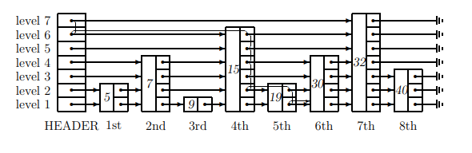
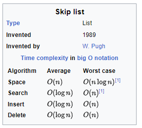
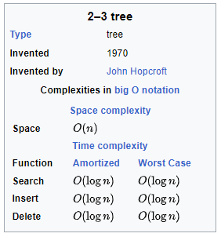
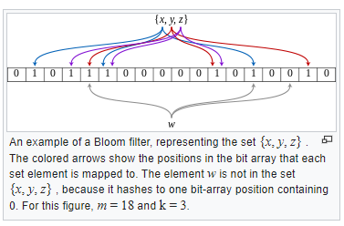

::: block
*That might be the right answer* {style=background:red;width:500px}
::: 

---

### What are we going to talk about?

- Two kinds of probabilistic data structures
   - Using randomness to make choices in algorithms
   - No longer just getting a right answer

---

### Why would you do that?

- Save resources for order of magnitude estimates (Morris)
- Some algorithms are too complicated to implement, and it's easier to get it right most of the time (Skip Lists)
- Too much data means we might prefer an approximate answer (Count-min sketch, Bloom filters)
- Estimate the number of distinct elements you've seen (HyperLogLog)
- And in the future, Quantum Computers 

---

### Big data processing

- Lambda architectures
- See [Highly Scalable blog post](https://highlyscalable.wordpress.com/2012/05/01/probabilistic-structures-web-analytics-data-mining/)

---

### Randomization for the good

- Deterministic hashing can lead to a DOS
  - Add a random number, chosen per run, into the hash algorithm
- ANTS memory profiler used [C5](https://github.com/sestoft/C5), made a bug hard to reproduce (until you knew about it)

---

### Order of Magnitude Estimators

- [Morris](https://en.wikipedia.org/wiki/Approximate_counting_algorithm)
- Don't increment count every time, but instead count to the nearest power of two
  - Suppose the magntude is 4 = 2^2
  - When we increment, throw two coins and only increment if we get two heads

---

### See C# implementation

---

### [Skip Lists](https://en.wikipedia.org/wiki/Skip_list)

- Remember those 2-3 trees or red-black or AVL trees from University
- Really hard/fiddly to implement the rotate operation
- Maybe you can get it right most of the time
- Parallel friendly, cache less so

---

---

---

### And now for something different

- Two algorithms with uncertainty

- Multiple hash functions to find a group of locations
  - Then use the locations to get the answer
- Bloom Filter - binary values and do "AND"
- Count-min sketch - integer values and take the min
- The combining operation makes it approximate

---

### [Bloom filter](https://en.wikipedia.org/wiki/Bloom_filter)

- Possibly in the set
- Definitely not in the set

---

### [Count-min sketch](https://en.wikipedia.org/wiki/Count%E2%80%93min_sketch)

- Use integer values
- Count by incrementing all the locations
- Fetch count by taking the minimum of the locations

---

### [HyperLogLog](https://en.wikipedia.org/wiki/HyperLogLog)

- Based on the original [Flajolet-Martin algorithm](https://en.wikipedia.org/wiki/Flajolet%E2%80%93Martin_algorithm)
- Estimate distinct elements in a multi-set
    - [How to Count a Billion Distinct objects using only 1.5KB of memory](http://highscalability.com/blog/2012/4/5/big-data-counting-how-to-count-a-billion-distinct-objects-us.html)

---

### See C# implementation

---

### And that's it

- Sometimes the right answer isn't 100% necessary
- Sometimes that means something is easier to implement or is more parallel friendly

- But doing the maths to check its correctness can be realy hard
