::: block
*A quick dive into NoSQL* {style=background:red;width:500px}
:::

---

### UNDER CONSTRUCTION

 <!-- .slide: data-background="#ff0000" -->

This is the start of some slides for Redgate's Level Up conference in June<!-- .slide: data-fullscreen -->

---

#### Where are we going to cover?

- What does NoSQL mean?

- Why not always relational?

- The challenges and fixes

- The famous four (+1)

- And the others

- And one database to rule them all 

<aside class="notes">
<i>I was surprised by NoSQL and wondered why we couldn't use standard relational engines for everything.</i>
</aside>

---

#### Where are we going?

- Some theory

- Some practice

- Too many slides but many links for you to follow

---

#### What does NoSQL mean?

- SQL referring to the implementation model

  - relational tables, foreign keys, serialization modes

---

#### What does NoSQL mean?

-	[The usage of “NoSQL” that we recognize today traces back to a meetup on June 11, 2009 in San Francisco organized by Johan Oskarsson, a software developer based in London.](https://learning.oreilly.com/library/view/nosql-distilled-a/9780133036138/ch01.html#ch01lev1sec5) 

-	Asked on Cassandra IRC – Eric Evans (not that one)

---

#### What makes up a SQL database?

- Base this on Sql Server

- A transaction log (WAL)

- A set of data pages 

- Indexing structures (likely a BTree)
  - with other secondary indexes

- Lock manager

---

#### [See this book](https://learning.oreilly.com/library/view/pro-sql-server/9781484219645/)

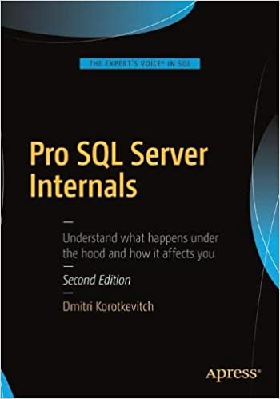

---

#### [8KB pages](https://learning.oreilly.com/library/view/pro-sql-server/9781484219645/A313962_2_En_1_Chapter.html#Fig6)

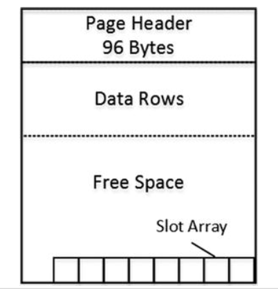

---

#### [one special index that controls how the data is laid out](https://learning.oreilly.com/library/view/pro-sql-server/9781484219645/A313962_2_En_2_Chapter.html#Fig12)

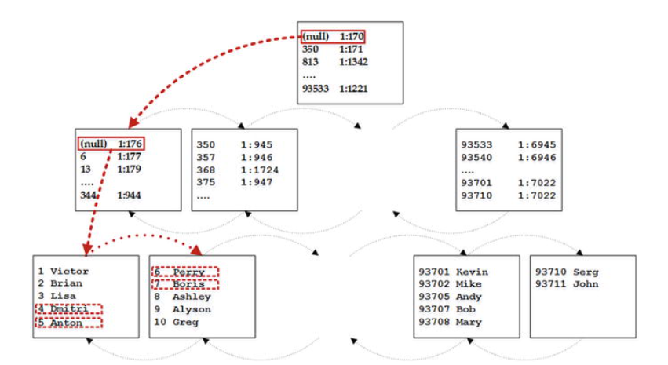

---

#### [Using the buffer pool](https://learning.oreilly.com/library/view/pro-sql-server/9781484219645/A313962_2_En_1_Chapter.html#Fig17) 

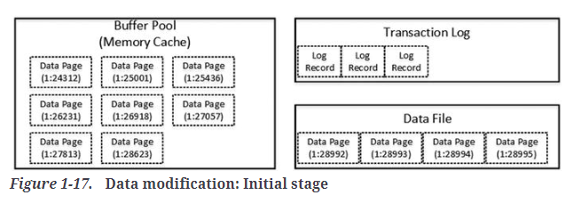

---

#### [Using the buffer pool for a modification](https://learning.oreilly.com/library/view/pro-sql-server/9781484219645/A313962_2_En_1_Chapter.html#Fig18) 

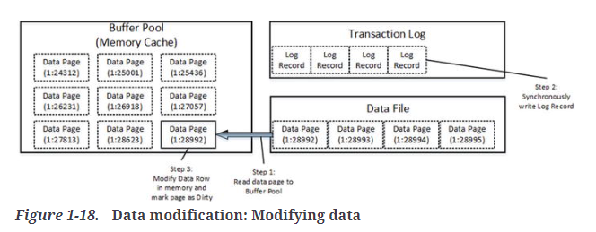

---

#### Extended over time

- Column stores (emphasis on read)

  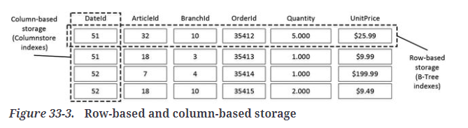

- CTEs to allow you to simulate graphs

  - then added to [Sql Server 2017](https://learn.microsoft.com/en-us/sql/relational-databases/graphs/sql-graph-overview?view=sql-server-ver16) and [Azure Sql Database](https://devblogs.microsoft.com/azure-sql/graphdb-part2/) 

- PostgreSQL and its many extensions

---

#### Relational leads to impedance mismatch

- For data warehouses like [Azure Synapse Analytics](https://learn.microsoft.com/en-us/azure/synapse-analytics/sql-data-warehouse/sql-data-warehouse-tables-overview)
  - star schemas so no foreign keys
  - focus on column store
  - can store in parquet

- Not using foreign keys

- Prefer optimistic locks over pessimistic locking

- [Starbucks does not use 2PC](https://www.enterpriseintegrationpatterns.com/ramblings/18_starbucks.html)

---

#### It's all about the amplification

- When we do a read, do we just get the data we want

- When we make a small update, how many data pages are touched

- How much memory do we need to use to keep it running efficiently

---

#### [The RUM conjecture](https://stratos.seas.harvard.edu/files/stratos/files/rum.pdf)

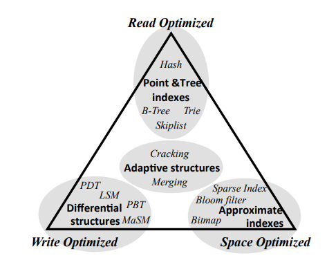

---

#### It's all about the clustering

- Read replicas, but typically one leader node 
  - ie leader-followers

- Data size grows, and we can only vertically scale so much
  - then you have to shard and typically this requires work from the application
    - horizontally - entities into different machines
    - vertically - a slice through the data

---

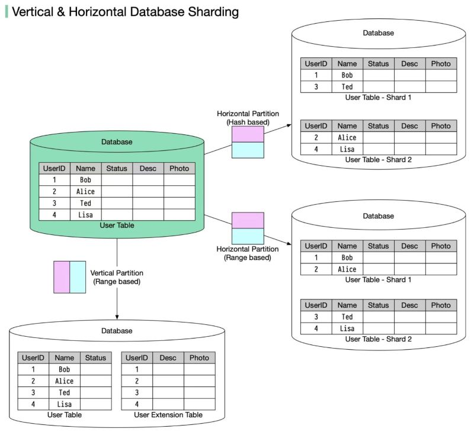

---

#### Sharding Issues

-	Application complexity.

-	Crippled SQL.

-	Loss of transactional integrity. 

-	Operational complexity. 

<aside class="notes">
It’s up to the application code to route SQL requests to the correct shard. This can be really hard.
In a sharded database, it is not possible to issue a SQL statement that operates across shards. 
ACID transactions against multiple shards are not possible—or at least not practical.
Load balancing across shards becomes extremely problematic.
</aside>

---

#### Sharding has it's own theory

- Facebook TAO

- [RAMP](https://people.eecs.berkeley.edu/~alig/papers/ramp.pdf)

- [RAMP TAO](https://www.vldb.org/pvldb/vol14/p3014-cheng.pdf)

- Implemented as a client library, it's nicer if it is automatic

---

#### [The CAP theorem](https://en.wikipedia.org/wiki/CAP_theorem)

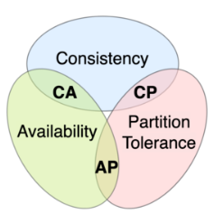

[From Next Generation Databases](https://learning.oreilly.com/library/view/next-generation-databases/9781484213292/9781484213308_Ch03.xhtml#_Fig4)

---

#### [CAP classification](https://bikas-katwal.medium.com/mongodb-vs-cassandra-vs-rdbms-where-do-they-stand-in-the-cap-theorem-1bae779a7a15)

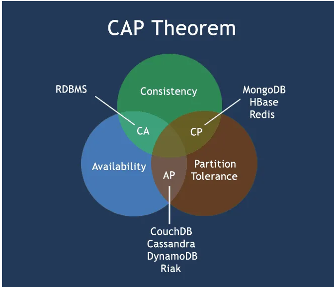

---

#### Beware

- [The CAP theorem 12 years later](https://www.infoq.com/articles/cap-twelve-years-later-how-the-rules-have-changed/)

- [Many other blog posts discuss it](https://markburgess.org/blog_cap.html)

---

#### [Variable consistency levels](https://learning.oreilly.com/library/view/next-generation-databases/9781484213292/9781484213308_Ch09.xhtml#Sec5)

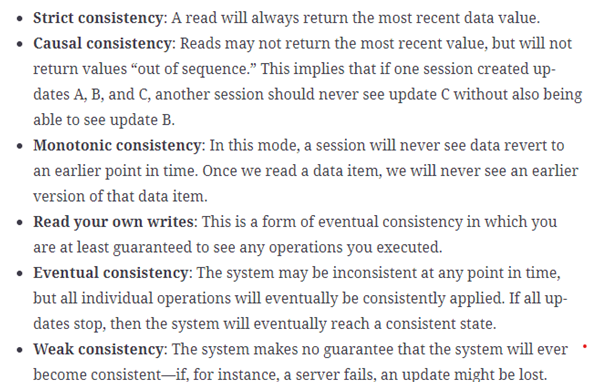

---

#### And ignore the ACID BASE 

- [ACID](https://en.wikipedia.org/wiki/ACID)
- [BASE](https://en.wikipedia.org/wiki/Eventual_consistency)
  - basically available soft-state eventually consistent
---

#### People have extended relational clustering

- [Oracle’s Real Application Clusters (RAC)](https://www.oracle.com/uk/database/real-application-clusters/) is the most significant example of a transparently scalable, ACID compliant, relational cluster.

---

#### Before the NoSQL 

- File system (Map-Reduce)

---

#### The NoSQL Alternatives

- Key-Value - Redis/Memcached/etcd (etc distributed)

- Document - MongoDB

- Column-family stores - Cassandra

- Graph databases - Neo4J

---

#### And also

- NewSQL - Spanner

- Spatial - PostGIS

- Time series - InfluxDB/TimescaleDB

---

#### File system

- The original system for processing lots of big data. 

- Map and reduce phases
  - data shuffling

- Large clusters

- Design influenced by the need to restart jobs
  -  BORG heritage

---

#### Example of map-reduce

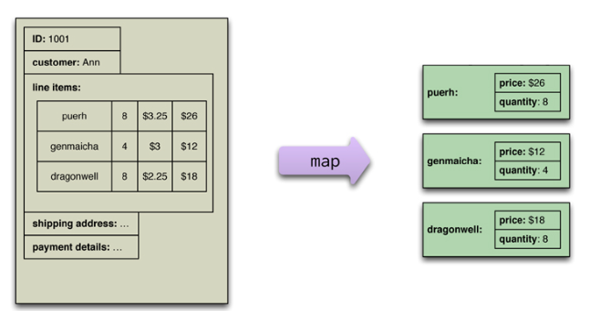

[From NoSql distilled](https://learning.oreilly.com/library/view/nosql-distilled-a/9780133036138/ch07.html#ch07fig03)

---

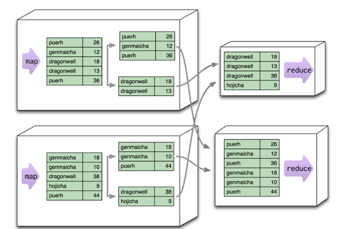

[From NoSql distilled](https://learning.oreilly.com/library/view/nosql-distilled-a/9780133036138/ch07.html#ch07fig03)

---

#### [Map Reduce Design Patterns](https://www.amazon.co.uk/MapReduce-Design-Patterns-Effective-Algorithms/dp/1449327176)

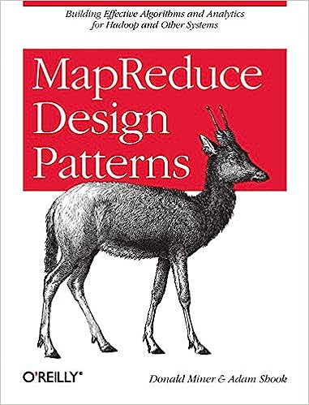

---

#### [KV and Document DBs are aggregate-oriented](https://learning.oreilly.com/library/view/nosql-distilled-a/9780133036138/ch02.html#ch02lev1sec2)

- In a KV, the aggregate are opaque

- In a Document DB, the structure of the aggregate can be seen and queried 

---

### Customer Orders from a relational data model

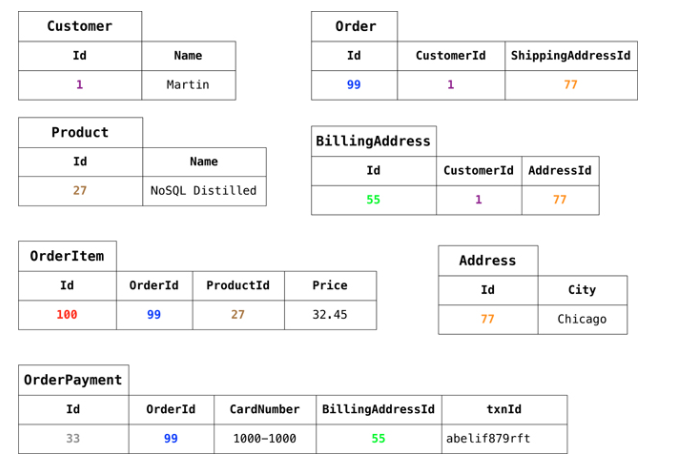

[From NoSQL Distilled](https://learning.oreilly.com/library/view/nosql-distilled-a/9780133036138/ch02.html#ch02fig02)

---

<pre>
// in customers
{
"id":1,
"name":"Martin",
"billingAddress":[{"city":"Chicago"}]
}

// in orders
{
"id":99,
"customerId":1,
"orderItems":[
  {
  "productId":27,
  "price": 32.45,
  "productName": "NoSQL Distilled"
    }
  ],
"shippingAddress":[{"city":"Chicago"}]
"orderPayment":[
  {
    "ccinfo":"1000-1000-1000-1000",
    "txnId":"abelif879rft",
    "billingAddress": {"city": "Chicago"}
  }
  ],
}</pre>

---

<pre>
// in customers
{
"customer": {
"id": 1,
"name": "Martin",
"billingAddress": [{"city": "Chicago"}],
"orders": [
  {
    "id":99,
    "customerId":1,
    "orderItems":[
    {
    "productId":27,
    "price": 32.45,
    "productName": "NoSQL Distilled"
    }
  ],
  "shippingAddress":[{"city":"Chicago"}]
  "orderPayment":[
    {
    "ccinfo":"1000-1000-1000-1000",
    "txnId":"abelif879rft",
    "billingAddress": {"city": "Chicago"}
    }],
  }]
}
}
</pre>

---

#### Key Value stores

- Good for write heavy workloads

- Offer locking of keys

- Offer auto-deletion after time

---

#### Redis

<pre>
docker run --name my-redis -p 6379:6379 -d redis
docker exec -it my-redis sh
redis-cli
</pre>

---

### Redis datatypes

- strings
- lists
- sets, sorted sets
- hashes
- streams
- bitmaps
- hyperloglog

---

#### Redis example

<pre>
127.0.0.1:6379> set name Monica
OK
127.0.0.1:6379> get name
"Monica"
127.0.0.1:6379> del name
(integer) 1
127.0.0.1:6379> rpush name Clive
(integer) 1
127.0.0.1:6379> rpush name Andrew
(integer) 2
127.0.0.1:6379> rpush name Tong
(integer) 3
127.0.0.1:6379> lrange name 0 10
1) "Clive"
2) "Andrew"
3) "Tong"
127.0.0.1:6379>s
</pre>

---

#### Some quick points

- Single-threaded
- Emphasise in-memory for speed
- Great for caches and shopping carts

---

#### [MongoDB](https://learning.oreilly.com/library/view/mongodb-the-definitive/9781491954454/ch01.html)

MongoDB is a document-oriented database, not a relational one. The primary reason for moving away from the relational model is to make scaling out easier, but there are some other advantages as well.

A document-oriented database replaces the concept of a “row” with a more flexible model, the “document.” By allowing embedded documents and arrays, the document-oriented approach makes it possible to represent complex hierarchical relationships with a single record. This fits naturally into the way developers in modern object-oriented languages think about their data.

---

#### Example

<pre>
docker run -d --name test-mongo mongo:latest
docker exec -it test-mongo bash
mongosh
</pre>

---

#### MongoDB example

<pre>
test> show databases
admin    8.00 KiB
config  12.00 KiB
local    8.00 KiB
test> db.user.insertOne({name: "Ada Lovelace", age: 205})
{
  acknowledged: true,
  insertedId: ObjectId("648daa58fdb6ea99a11c5b89")
}
test> show databases
admin    8.00 KiB
config  12.00 KiB
local    8.00 KiB
test     8.00 KiB
test> db.user.find({ age: { "$gt": 200 }})
[
  {
    _id: ObjectId("648daa58fdb6ea99a11c5b89"),
    name: 'Ada Lovelace',
    age: 205
  }
]
</pre>

---

#### Note we are talking full documents here

- arbitarily nested JSON stored in binary form, BSON

---

#### Indexing and sharding

- You can define indexes

- You can get the system to shard large collections

- You can do transactions

---

### Materialized Views

- [Aggregation Operations](https://www.mongodb.com/docs/manual/aggregation/) and [stored procedures](https://www.mongodb.com/features/stored-procedures)

- [We should talk about materialized views](https://www.mongodb.com/docs/manual/core/materialized-views/)

---

#### The 50 words

[Apache Cassandra is an open source, distributed, decentralized, elastically scalable, highly available, fault-tolerant, tuneably consistent, row-oriented database. Cassandra bases its distribution design on Amazon’s Dynamo and its data model on Google’s Bigtable, with a query language similar to SQL. Created at Facebook, it now powers cloud-scale applications across many industries.](https://learning.oreilly.com/library/view/cassandra-the-definitive/9781098115159/ch02.html#cassandra_in_50_words_or_less)

---

#### Cassandra

- Written by Facebook to handle write heavy

- Cool tech, SSTables and LSTM
  - handle the write and do the work later

- Highly configurable for acks on write

---

#### [Some key points](https://cassandra.apache.org/doc/latest/cassandra/data_modeling/data_modeling_rdbms.html)

- No joins

- No referential integrity

- Denormalization

- Query-first design

- Design for optimal storage

- Sorting is a design decision

---

#### [That sounds a lot like MongoDB](https://www.mongodb.com/compare/cassandra-vs-mongodb)

| Cassandra      | MongoDB |
| ----------- | ----------- |
| Wide column      | BSON       |
| Builtin plus some secondary indexes   | Many index types        |
| CQL | MQL        |
| No transactions | ACID compliant transactions |
| Row level concurrency control | Document level locking |
| Multi-master | Replication/Sharding |

---

#### Example

<pre>
docker pull cassandra
docker run -d --name cassandra-docker -p 9842:9842 cassandra
docker exec -it cassandra-docker bash
cqlsh
</pre>

---

#### Example

<pre>
root@94efcf73333f:/# cqlsh
Connection error: ('Unable to connect to any servers', {'127.0.0.1:9042': ConnectionRefusedError(111, "Tried connecting to [('127.0.0.1', 9042)]. Last error: Connection refused")})
root@94efcf73333f:/# cqlsh
Connected to Test Cluster at 127.0.0.1:9042
[cqlsh 6.1.0 | Cassandra 4.1.2 | CQL spec 3.4.6 | Native protocol v5]
Use HELP for help.
cqlsh> CREATE KEYSPACE IF NOT EXISTS store
   ...    WITH REPLICATION = { 'class' : 'SimpleStrategy', 'replication_factor' : '1' };
cqlsh> CREATE TABLE IF NOT EXISTS store.shopping_cart
   ...   (userid text PRIMARY KEY, item_count int, last_update_timestamp timestamp);
cqlsh> INSERT INTO store.shopping_cart(userid, item_count, last_update_timestamp)
   ...   VALUES ('9876', 2, toTimeStamp(now()));
cqlsh> INSERT INTO store.shopping_cart(userid, item_count, last_update_timestamp)
   ...   VALUES ('1234', 5, toTimeStamp(now()));
cqlsh> SELECT * FROM store.shopping_cart;

 userid | item_count | last_update_timestamp
--------+------------+---------------------------------
   1234 |          5 | 2023-06-17 12:47:42.954000+0000
   9876 |          2 | 2023-06-17 12:47:34.072000+0000

(2 rows)
cqlsh>
</pre>

---

#### Quorum overlap 

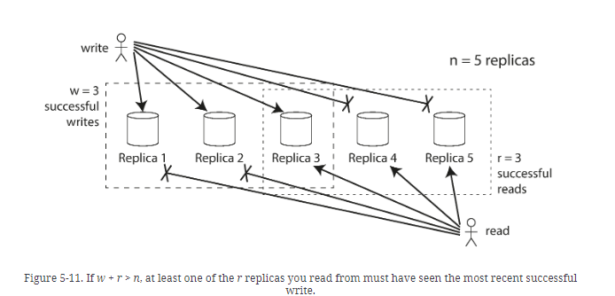

[From Designing Data Intensive Applications](https://learning.oreilly.com/library/view/designing-data-intensive-applications/9781491903063/ch05.html#fig_replication_quorum_overlap)

---

#### In particular

- ONE

- TWO

- THREE

- QUORUM 
  - A majority (n/2 + 1) of the replicas must respond.

- ALL
  - All of the replicas must respond.

---

#### Read repair and hinted handoff

- [Hinted handoff](https://learning.oreilly.com/library/view/cassandra-the-definitive/9781098115159/ch06.html#hinted_handoff) 
  - store message for other nodes

- [Read repair](https://learning.oreilly.com/library/view/next-generation-databases/9781484213292/9781484213308_Ch09.xhtml#Sec17) 
  - [fix up nodes that have incorrect information](https://learning.oreilly.com/library/view/cassandra-the-definitive/9781098115159/ch06.html#anti-entropy_comma_repair_comma_and_merk)
- Cool things 
  - [SSTables](https://learning.oreilly.com/library/view/cassandra-the-definitive/9781098115159/ch06.html#internal_data_structures_and_files)
  -  [optimizations like Bloom filters](https://learning.oreilly.com/library/view/cassandra-the-definitive/9781098115159/ch06.html#bloom_filters)

---

#### Graph databases

- Lots of things are better represented as a graph

- Neo4j

---

### Example

<pre>
docker run --name testneo4j --env NEO4J_AUTH=neo4j/password neo4j:latest
docker exec -it testneo4j bash
cypher-shell -u neo4j -p password
</pre>

---

### [Define a graph](https://neo4j.com/docs/cypher-manual/current/clauses/match/)

<pre>
CREATE
  (charlie:Person {name: 'Charlie Sheen'}),
  (martin:Person {name: 'Martin Sheen'}),
  (michael:Person {name: 'Michael Douglas'}),
  (oliver:Person {name: 'Oliver Stone'}),
  (rob:Person {name: 'Rob Reiner'}),
  (wallStreet:Movie {title: 'Wall Street'}),
  (charlie)-[:ACTED_IN {role: 'Bud Fox'}]->(wallStreet),
  (martin)-[:ACTED_IN {role: 'Carl Fox'}]->(wallStreet),
  (michael)-[:ACTED_IN {role: 'Gordon Gekko'}]->(wallStreet),
  (oliver)-[:DIRECTED]->(wallStreet),
  (thePresident:Movie {title: 'The American President'}),
  (martin)-[:ACTED_IN {role: 'A.J. MacInerney'}]->(thePresident),
  (michael)-[:ACTED_IN {role: 'President Andrew Shepherd'}]->(thePresident),
  (rob)-[:DIRECTED]->(thePresident),
  (martin)-[:FATHER_OF]->(charlie);
</pre>

---

---

### And query

<pre>
neo4j@neo4j> MATCH (director {name: 'Oliver Stone'})--(movie)
                          RETURN director.name, movie.title;
+--------------------------------+
| director.name  | movie.title   |
+--------------------------------+
| "Oliver Stone" | "Wall Street" |
+--------------------------------+

1 row
ready to start consuming query after 144 ms, results consumed after another 4 ms
</pre>

---

#### Time series Databases

- [TimescaleDB](https://docs.timescale.com/getting-started/latest/)

- Timescale extends PostgreSQL for time-series and analytics, so you can build faster, scale further, and stay under budget.

- [Querying](https://docs.timescale.com/getting-started/latest/query-data/)

- [Compression and automatic compression](https://docs.timescale.com/getting-started/latest/compress-data/)

---

#### But you don't have to use a different storage engine

- Azure Cosmos DB supports multipe models by converting to Document DB format

---

#### Azure Cosmos DB

- multi-model

- native Document DB

- Azure Table

- Mongo DB

- [Gremlin](https://docs.janusgraph.org/getting-started/gremlin/) [graph](https://kelvinlawrence.net/book/Gremlin-Graph-Guide.html#gremlinandsql) 

---

#### And there are more controls

- [under the hood](https://rajneeshprakash.medium.com/cosmos-db-under-the-hood-2d4ce920bb7e)
- [automatic indexing](https://www.vldb.org/pvldb/vol8/p1668-shukla.pdf)
- [choice of consistency levels](https://learn.microsoft.com/en-us/azure/cosmos-db/consistency-levels)

---

#### Summary

- There are many types of data storage that may more cleanly map your data model (avoiding ORM hell)

- There are tradeoffs depending on your requiremenst for consistency and read-write patterns

- [A handy cheatsheet](https://twitter.com/alexxubyte/status/1665748892296830982) 
