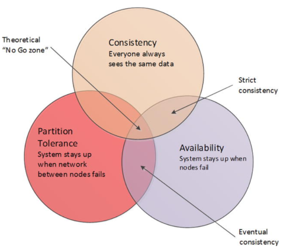
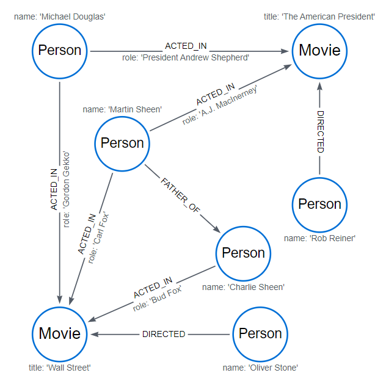

::: block
*A quick dive into NoSQL* {style=background:red;width:500px}
:::

---

### UNDER CONSTRUCTION

 <!-- .slide: data-background="#ff0000" -->

This is the start of some slides for Redgate's Level Up conference in June

---

### Where are we going?

- What does NoSQL mean?
- Why not always relational?
- The challenges - RUM/CAP
- The famous four (+1)
- And the others
- And one database to rule them all 

<aside class="notes">
<i>I was surprised by NoSQL and wondered why we couldn't use standard relational engines for everything.</i>
</aside>

---

### What does NoSQL mean?

- referring to "not the language" but its model
- relational tables
- foreign keys
- serialization modes (locks)

---

### What does NoSQL mean?

-	[The usage of “NoSQL” that we recognize today traces back to a meetup on June 11, 2009 in San Francisco organized by Johan Oskarsson, a software developer based in London.](https://learning.oreilly.com/library/view/nosql-distilled-a/9780133036138/ch01.html#ch01lev1sec5) 
-	Asked on Cassandra IRC – Eric Evans (not that one)


---

### What makes up a SQL database?

- base this on Sql Server
- a transaction log (WAL)
- a set of data pages 
- indexing structures (likely a BTree)
- with other secondary indexes
- lock manager

---

### See this book


---

### [8KB pages](https://learning.oreilly.com/library/view/pro-sql-server/9781484219645/A313962_2_En_1_Chapter.html#Fig6)


---

### [one special index that controls how the data is laid out](https://learning.oreilly.com/library/view/pro-sql-server/9781484219645/A313962_2_En_2_Chapter.html#Fig12)


---

### Extended over time

- column stores (emphasis on read)
- CTEs to allow you to simulate graphs
- simulate because you have to formulate some of the harder questions into code
- then added to [Sql Server 2017](https://learn.microsoft.com/en-us/sql/relational-databases/graphs/sql-graph-overview?view=sql-server-ver16) and [Azure Sql Database](https://devblogs.microsoft.com/azure-sql/graphdb-part2/) 
- PostgreSQL and its many extensions

---

### Relational leads to impedance mismatch

- not using foreign keys
- prefer optimistic locks over pessimistic locking

- for data warehouses, 
  - star schemas typically no implementation of foreign keys and focus on column store
  - store in parquet (or other encoding) on the disk and bring to life later
- [Starbucks does not use 2PC](https://www.enterpriseintegrationpatterns.com/ramblings/18_starbucks.html)

---

### It's all about the amplification

- when we do a read, do we just get the data we want
- when we make a small update, how many data pages are touched
- how much memory do we need to use to keep it running efficiently

---

### [The RUM conjecture](https://stratos.seas.harvard.edu/files/stratos/files/rum.pdf)


---

### It's all about the clustering

- read replicas, but typically one master node (ie master-slaves)

- data size grows, and we can only vertically scale so much
  - then you have to shard
  - typically this requires work from the application

- Horizontally - entities into different machines
- Vertically - a slice through the data

---

### Sharding Issues

-	Application complexity.
-	Crippled SQL.
-	Loss of transactional integrity. 
-	Operational complexity. 

<aside class="notes">
It’s up to the application code to route SQL requests to the correct shard. This can be really hard.
In a sharded database, it is not possible to issue a SQL statement that operates across shards. 
ACID transactions against multiple shards are not possible—or at least not practical.
Load balancing across shards becomes extremely problematic.
</aside>

---

### Sharding has it's own theory

- Facebook TAO
- [RAMP](https://people.eecs.berkeley.edu/~alig/papers/ramp.pdf)
- [RAMP TAO](https://www.vldb.org/pvldb/vol14/p3014-cheng.pdf)
- implemented as a client library, it's nicer if it is automatic

---

### [The CAP theorem](https://en.wikipedia.org/wiki/CAP_theorem)



[From Next Generation Databases](https://learning.oreilly.com/library/view/next-generation-databases/9781484213292/9781484213308_Ch03.xhtml#_Fig4)

---

### [CAP classification](https://bikas-katwal.medium.com/mongodb-vs-cassandra-vs-rdbms-where-do-they-stand-in-the-cap-theorem-1bae779a7a15)


---

### Variable consistency levels

- Strict Consistency
- Causal Consistency
- Monotonic Consistency
- Read Your Own Writes
- Eventual Consistency
- Weak Consistency

---

### People have extended relational clustering

- Oracle’s Real Application Clusters (RAC) is the most significant example of a transparently scalable, ACID compliant, relational cluster.

---

### The alternatives - side step

- file system (Map-Reduce)

---

### The alternatives

- KV - Redis/Memcached/etcd (etc distributed)
- document - MongoDB
- column-family stores - Cassandra
- graph databases - Neo4J

---

### And also

- NewSQL (Spanner)
- spatial (PostGIS)
- time series InfluxDB/TimescaleDB

---

### File system

- The original system for processing lots of big data. 
- Map phase/Reduce phase with data shuffling happening in the middle
- Large clusters
- Design influenced by the need to restart jobs

---

### Key Value stores

- good for write heavy workloads
- offer locking of keys
- offer auto-deleteion after time

---

### Redis

``` 
docker run --name my-redis -p 6379:6379 -d redis
docker exec -it my-redis sh
```

---

### Redis datatypes

- strings
- lists
- sets, sorted sets
- hashes
- streams
- bitmaps
- hyperloglog

---

### Redis example

```
set name Monica
get name
del name

rpush name Clive
rpush name Andrew 
rpush name Tong
lrange name 0 10

```

---

### Some quick points

- single-threaded
- emphasise in-memory for speed

---

### MongoDB

```
docker run -d --name test-mongo mongo:latest
docker exec -it test-mongo bash
mongosh
```

---

### MongoDB example

```
show databases
db.user.insertOne({name: "Ada Lovelace", age: 205})
show databases
db.user.find({ age: { "$gt": 200 }})

```

---

### Indexing and sharding

- you can define indexes
- you can get the system to shard large collections
- you can do transactions

---

### The 50 words

[Apache Cassandra is an open source, distributed, decentralized, elastically scalable, highly available, fault-tolerant, tuneably consistent, row-oriented database. Cassandra bases its distribution design on Amazon’s Dynamo and its data model on Google’s Bigtable, with a query language similar to SQL. Created at Facebook, it now powers cloud-scale applications across many industries.](https://learning.oreilly.com/library/view/cassandra-the-definitive/9781098115159/ch02.html#cassandra_in_50_words_or_less)

---

### Cassandra

- written by Facebook to handle write heavy
- SSTables and LSTM
- handle the write and do the work later

- highly configurable for acks on write

---

### [Some key points](https://cassandra.apache.org/doc/latest/cassandra/data_modeling/data_modeling_rdbms.html)

- No joins
- No referential integrity
- Denormalization
- Query-first design
- Design for optimal storage
- Sorting is a design decision

---

### That sounds a lot like MongoDB

- compare with Mongo https://www.mongodb.com/compare/cassandra-vs-mongodb

---

### Example

<pre>
docker pull cassandra:latest
docker network create cassandra
docker run --rm -d --name cassandra --hostname cassandra --network cassandra cassandra
docker run --rm -it --network cassandra nuvo/docker-cqlsh cqlsh cassandra 9042 --cqlversion='3.4.6'
</pre>

---

### Example

<pre>
CREATE KEYSPACE IF NOT EXISTS store WITH REPLICATION = { 'class' : 'SimpleStrategy', 'replication_factor' : '1' };
CREATE TABLE IF NOT EXISTS store.shopping_cart (userid text PRIMARY KEY, item_count int, last_update_timestamp timestamp);
INSERT INTO store.shopping_cart(userid, item_count, last_update_timestamp) VALUES ('9876', 2, toTimeStamp(now()));
INSERT INTO store.shopping_cart(userid, item_count, last_update_timestamp) VALUES ('1234', 5, toTimeStamp(now()));
SELECT * FROM store.shopping_cart;
</pre>

---

### Quorum overlap - choice of readers and writers


[From Designing Data Intensive Applications](https://learning.oreilly.com/library/view/designing-data-intensive-applications/9781491903063/ch05.html#fig_replication_quorum_overlap)

---

### In particular

- ONE
- TWO
- THREE
- QUORUM    A majority (n/2 + 1) of the replicas must respond.
- ALL       All of the replicas must respond.

---

### A quick note on read repair and hinted handoff

- hinted handoff - store message for other nodes
- [read repair](https://learning.oreilly.com/library/view/next-generation-databases/9781484213292/9781484213308_Ch09.xhtml#Sec17) - fix up nodes that have incorrect information

---

### Graph databases

- Neo4j
- lots of things are better represented as a graph

---

### Example

<pre>
docker run --name testneo4j --env NEO4J_AUTH=neo4j/password neo4j:latest
docker exec -it testneo4j bash
cypher-shell -u neo4j -p password
</pre>

---

### [Define a graph](https://neo4j.com/docs/cypher-manual/current/clauses/match/)

<pre>
CREATE
  (charlie:Person {name: 'Charlie Sheen'}),
  (martin:Person {name: 'Martin Sheen'}),
  (michael:Person {name: 'Michael Douglas'}),
  (oliver:Person {name: 'Oliver Stone'}),
  (rob:Person {name: 'Rob Reiner'}),
  (wallStreet:Movie {title: 'Wall Street'}),
  (charlie)-[:ACTED_IN {role: 'Bud Fox'}]->(wallStreet),
  (martin)-[:ACTED_IN {role: 'Carl Fox'}]->(wallStreet),
  (michael)-[:ACTED_IN {role: 'Gordon Gekko'}]->(wallStreet),
  (oliver)-[:DIRECTED]->(wallStreet),
  (thePresident:Movie {title: 'The American President'}),
  (martin)-[:ACTED_IN {role: 'A.J. MacInerney'}]->(thePresident),
  (michael)-[:ACTED_IN {role: 'President Andrew Shepherd'}]->(thePresident),
  (rob)-[:DIRECTED]->(thePresident),
  (martin)-[:FATHER_OF]->(charlie)
</pre>

---



---

### And query

<pre>
neo4j@neo4j> MATCH (director {name: 'Oliver Stone'})--(movie)
                          RETURN director.name, movie.title;
+--------------------------------+
| director.name  | movie.title   |
+--------------------------------+
| "Oliver Stone" | "Wall Street" |
+--------------------------------+

1 row
ready to start consuming query after 144 ms, results consumed after another 4 ms
</pre>

---

### Time series Databases

- [TimescaleDB](https://docs.timescale.com/getting-started/latest/)
- Timescale extends PostgreSQL for time-series and analytics, so you can build faster, scale further, and stay under budget.
- [Querying](https://docs.timescale.com/getting-started/latest/query-data/)
- [Compression and automatic compression](https://docs.timescale.com/getting-started/latest/compress-data/)

---

### But you don't have to use a different storage engine

- Azure Cosmos DB supports multipe models by converting to Document DB format

---

### Azure Cosmos DB

- multi-model
- native Document DB
- Azure Table
- Mongo DB
- Gremlin graph - https://docs.janusgraph.org/getting-started/gremlin/ https://kelvinlawrence.net/book/Gremlin-Graph-Guide.html#gremlinandsql
---

### And there are more controls

- https://rajneeshprakash.medium.com/cosmos-db-under-the-hood-2d4ce920bb7e
- automatic indexing
- choice of consistency levels - see the beautiful https://learn.microsoft.com/en-us/azure/cosmos-db/consistency-levels

