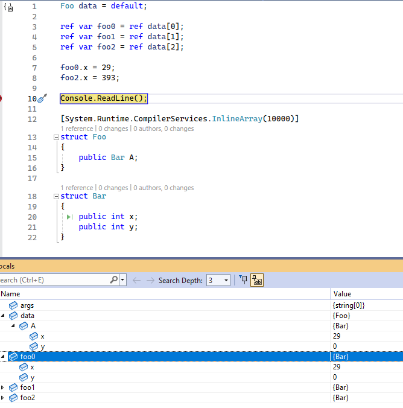
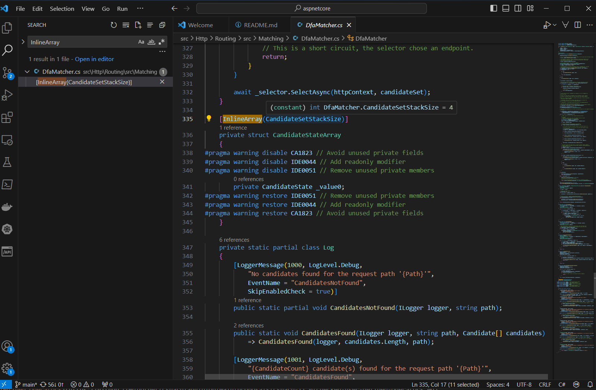
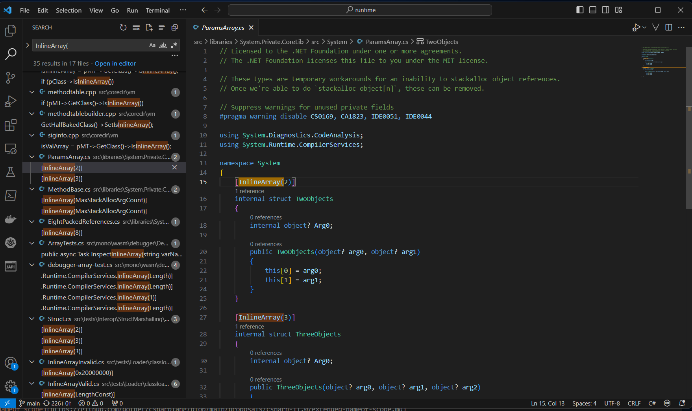
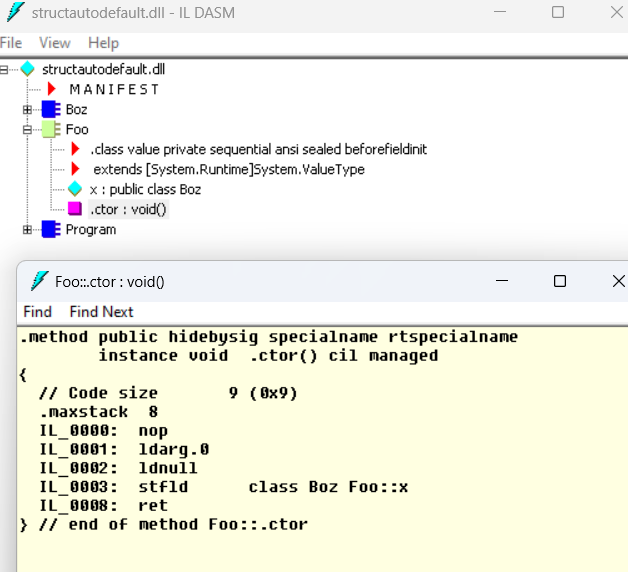
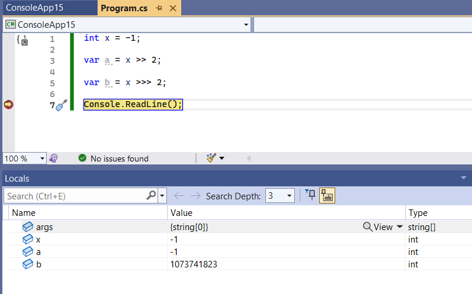
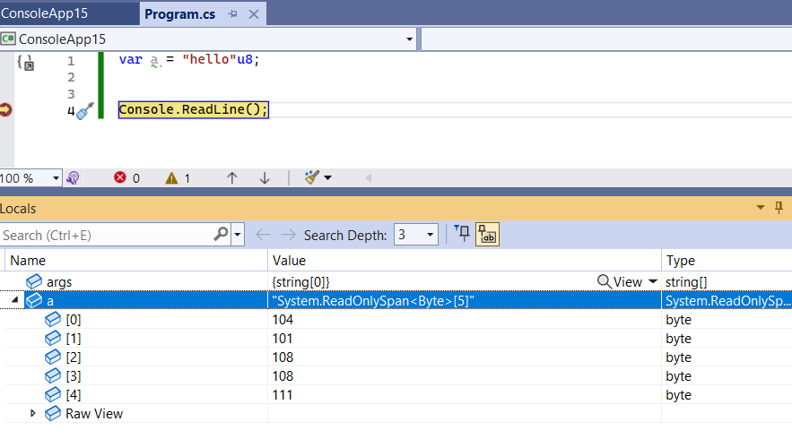

::: block
*Some modern C# features* {style=background:red;width:500px}
::: 

---

### What we have planned

- Today: features from the newer versions of C#
  -  (12...11...10...)
- December 8th: .NET Conf recap

---

### What we are doing today

- We'll go through the C# changes in reverse chronological order
  - Talk about the feature
  - Any questions?
  - Any discussion on usefulness and whether we should use it in the code base

---

### [C# 12](https://github.com/dotnet/csharplang/tree/main/proposals/csharp-12.0)

- [Collection Expressions](https://github.com/dotnet/csharplang/blob/main/proposals/csharp-12.0/collection-expressions.md) 
- [Experimental Attribute](https://github.com/dotnet/csharplang/blob/main/proposals/csharp-12.0/experimental-attribute.md)
- [Inline Arrays](https://github.com/dotnet/csharplang/blob/main/proposals/csharp-12.0/inline-arrays.md)
- [Lambda Method Group Definition](https://github.com/dotnet/csharplang/blob/main/proposals/csharp-12.0/lambda-method-group-defaults.md)
- [Primary Constructors](https://github.com/dotnet/csharplang/blob/main/proposals/csharp-12.0/primary-constructors.md)
- [Ref readonly parameters](https://github.com/dotnet/csharplang/blob/main/proposals/csharp-12.0/ref-readonly-parameters.md)
- [Using alias types](https://github.com/dotnet/csharplang/blob/main/proposals/csharp-12.0/using-alias-types.md)

---

### [C# 11](https://github.com/dotnet/csharplang/tree/main/proposals/csharp-11.0)

- [Auto default structs](https://github.com/dotnet/csharplang/blob/main/proposals/csharp-11.0/auto-default-structs.md)
- [Checked User Defined Operators](https://github.com/dotnet/csharplang/blob/main/proposals/csharp-11.0/checked-user-defined-operators.md)
- [Extended Nameof scope](https://github.com/dotnet/csharplang/blob/main/proposals/csharp-11.0/extended-nameof-scope.md)
- [File local types](https://github.com/dotnet/csharplang/blob/main/proposals/csharp-11.0/file-local-types.md)
- [Generic Attributes](https://github.com/dotnet/csharplang/blob/main/proposals/csharp-11.0/generic-attributes.md)
- [List Patterns](https://github.com/dotnet/csharplang/blob/main/proposals/csharp-11.0/list-patterns.md)
- [Low level struct improvements](https://github.com/dotnet/csharplang/blob/main/proposals/csharp-11.0/low-level-struct-improvements.md)
- [New line in interpolation](https://github.com/dotnet/csharplang/blob/main/proposals/csharp-11.0/new-line-in-interpolation.md)
- [Numeric Intptr](https://github.com/dotnet/csharplang/blob/main/proposals/csharp-11.0/numeric-intptr.md)
- [Pattern match span of char on string](https://github.com/dotnet/csharplang/blob/main/proposals/csharp-11.0/pattern-match-span-of-char-on-string.md)
- [Raw string literal](https://github.com/dotnet/csharplang/blob/main/proposals/csharp-11.0/raw-string-literal.md)

---

- [Relaxing shift operator requirements](https://github.com/dotnet/csharplang/blob/main/proposals/csharp-11.0/relaxing_shift_operator_requirements.md)
- [Required members](https://github.com/dotnet/csharplang/blob/main/proposals/csharp-11.0/required-members.md)
- [Static abstracts in interfaces](https://github.com/dotnet/csharplang/blob/main/proposals/csharp-11.0/static-abstracts-in-interfaces.md)
- [Unsigned right shift operator](https://github.com/dotnet/csharplang/blob/main/proposals/csharp-11.0/unsigned-right-shift-operator.md)
- [Utf8 string literals](https://github.com/dotnet/csharplang/blob/main/proposals/csharp-11.0/utf8-string-literals.md)
 
---

### [C# 10](https://github.com/dotnet/csharplang/tree/main/proposals/csharp-10.0)

- [Global and Implicit using](https://github.com/dotnet/csharplang/blob/main/proposals/csharp-10.0/GlobalUsingDirective.md)
- [Async method builders](https://github.com/dotnet/csharplang/blob/main/proposals/csharp-10.0/async-method-builders.md)
- [Caller argument expression](https://github.com/dotnet/csharplang/blob/main/proposals/csharp-10.0/caller-argument-expression.md)
- [Constant interpolated strings](https://github.com/dotnet/csharplang/blob/main/proposals/csharp-10.0/constant_interpolated_strings.md)
- [Enhanced line directives](https://github.com/dotnet/csharplang/blob/main/proposals/csharp-10.0/enhanced-line-directives.md)
- [Extended property patterns](https://github.com/dotnet/csharplang/blob/main/proposals/csharp-10.0/extended-property-patterns.md)
- [File scoped namespaces](https://github.com/dotnet/csharplang/blob/main/proposals/csharp-10.0/file-scoped-namespaces.md)
- [Improved definite assignment](https://github.com/dotnet/csharplang/blob/main/proposals/csharp-10.0/improved-definite-assignment.md)

---

- [Improved interpolated strings](https://github.com/dotnet/csharplang/blob/main/proposals/csharp-10.0/improved-interpolated-strings.md)
- [Lambda improvements](https://github.com/dotnet/csharplang/blob/main/proposals/csharp-10.0/lambda-improvements.md)
- [Parameterless struct constructors](https://github.com/dotnet/csharplang/blob/main/proposals/csharp-10.0/parameterless-struct-constructors.md)
- [Record structs](https://github.com/dotnet/csharplang/blob/main/proposals/csharp-10.0/record-structs.md)

---

### [Inline Arrays](https://github.com/dotnet/csharplang/blob/main/proposals/csharp-12.0/inline-arrays.md)

- Tracked references on the stack
- Stack allocation (a common theme)
- Don't make them too big (runtime exits)

---



---



---



---

- Methods in System.Runtime.CompilerServices.RuntimeHelpers 
- EnsureSufficientExecutionStack();
- And looking back CERs
  - ProbeForSufficientStack();

---

### [Auto Default Structs](https://github.com/dotnet/csharplang/blob/main/proposals/csharp-11.0/auto-default-structs.md)

Beginning with C# 11, if you don't initialize all fields in a struct, the compiler adds code to the constructor that initializes those fields to the default value.

---

- Some changes to definite assignment rules
- And some code added to the constructor

---

### But really...

- This feature makes it so that in struct constructors, we identify fields which were not explicitly assigned by the user before returning or before use, and initialize them implicitly to default instead of giving definite assignment errors.

---



---

- The best solution to the need to go through setters without setting the field twice
- See example 

---

### [Low Level Struct Improvements](https://github.com/dotnet/csharplang/blob/main/proposals/csharp-11.0/low-level-struct-improvements.md)

---

Earlier versions of C# added a number of low level performance features to the language: ref returns, ref struct, function pointers, etc. ... These enabled .NET developers to write highly performant code while continuing to leverage the C# language rules for type and memory safety. It also allowed the creation of fundamental performance types in the .NET libraries like Span<T>.

As these features have gained traction in the .NET ecosystem developers, both internal and external, have been providing us with information on remaining friction points in the ecosystem. Places where they still need to drop to unsafe code to get their work done, or require the runtime to special case types like `Span<T>`.

---

<pre>
readonly ref struct Span<T>
{
    readonly ref T _field;
    readonly int _length;

    // This constructor does not exist today but will be added as a part 
    // of changing Span<T> to have ref fields. It is a convenient, and
    // safe, way to create a length one span over a stack value that today 
    // requires unsafe code.
    public Span(ref T value)
    {
        _field = ref value;
        _length = 1;
    }
}
</pre>

---

See example of how `ref struct` is about stack allocation

---

### [Numeric IntPtr](https://github.com/dotnet/csharplang/blob/main/proposals/csharp-11.0/numeric-intptr.md)

- TL;DR: nint, nuint simply alias System.IntPtr and System.UIntPtr (conditionalized by the System.Runtime.CompilerServices.RuntimeFeature.NumericIntPtr feature)

---

### [Relaxing Shift Operator Requirements](https://github.com/dotnet/csharplang/blob/main/proposals/csharp-11.0/relaxing_shift_operator_requirements.md)

- the amount to shift by doesn't have to be an int
  - as some things might not convert to an int

---

### Drawbacks

- Users will be able to define operators that do not follow the recommended guidelines, such as implementing `cout << "string"` in C#.

---

### [Unsigned Right Shift Operator](https://github.com/dotnet/csharplang/blob/main/proposals/csharp-11.0/unsigned-right-shift-operator.md)

- `>>>` is an unsigned right shift operator

---



---

### [Utf8 String Literals](https://github.com/dotnet/csharplang/blob/main/proposals/csharp-11.0/utf8-string-literals.md)

---



---

### [Enhanced Line Directives](https://github.com/dotnet/csharplang/blob/main/proposals/csharp-10.0/enhanced-line-directives.md)

- The PDB contains a mapping from code to source
- This extends the mapping to help tools like Razor

---

- The PDB contains information like "from IL offset 12 this maps to (15,2) - (15,7) in foo.cs"

---

### [Extended Property Patterns](https://github.com/dotnet/csharplang/blob/main/proposals/csharp-10.0/extended-property-patterns.md)

- Allow property patterns to be nested

```
if (e is MethodCallExpression { Method.Name: "MethodName" })
```

instead of

```
if (e is MethodCallExpression { Method: { Name: "MethodName" } })
```


