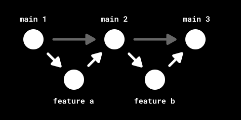
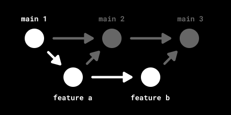
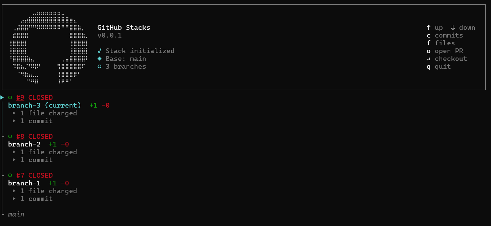

# Stack up those PRs without leaving the GitHub command line

---

## Why interested in this?

- Developer flow
  - no waiting for a review before moving on to next part of task

- Reviewer flow
  - make small logical units that are easy to review

- Build system flow
  - have a clear point where there is a complete unit of change where (some) testing makes sense

---

If I will have to wait, I am tempted to just keep adding more and more changes to the branch

The developer can tell me a story via the commits, but I'd rather have a story through PRs where there is a proper explanation of this part of the story

Our build systems currently leap onto individual commits and do a full build, including building the installers far too often for me.

Stacked PRs are likely not friendly to our current build system configurations; there could be a lot of rebasing if you have a deep stack, and the systems will enjoy building and testing the installers many times.

installers == any set of tests that hardly ever fails, or part of the product build that I don't need t use to make progress

---

## Advert from Big Tech

The [Pragmatic Engineer](https://newsletter.pragmaticengineer.com/p/stacked-diffs) says:

*One of my biggest personal “wow” moments during my time at Uber as a developer, was when I began using stacked diffs. Stacking refers to breaking down a pull request (PR) for a feature into several, smaller PRs which all depend on each other – hence the term “stacked”. It might sound counterintuitive, but this workflow is incredibly efficient by making it easier to review and modify PRs – or “diffs” as we called them at Uber.*

---

## So what are stacked PRs

Quick diagram from [www.stacking.dev](https://www.stacking.dev/)





---

## Concepts

Think of parts of the stack as branches which are based off each other

[Git supports --update-refs](https://andrewlock.net/working-with-stacked-branches-in-git-is-easier-with-update-refs/) but it isn't first class support

---

### Existing tooling

- Graphite

> Stacking lets you make many small PRs easily, and without having to wait for review. Traditional git workflows equate every feature with its own PR. A PR has its own branch, and is made up of several commits. The traditional, non-stacking workflow is this: Finish a feature, Submit a PR, Await PR approval, Merge back into main once approved

> Once the PR is merged, you want to start work on the next feature. So you branch off of main again and begin building.  Even at its most seamless, this process takes a long time! The biggest time waster is that PRs sit waiting for review for hours or days. We analyzed historical data for 15 million pull requests and PRs exist which waited several years to be merged! 

> Stacking makes the unit of change an individual commit, rather than a pull request composed of several commits. With stacking, you break up larger changes into many smaller ones. This change – a commit! – can be tested, reviewed, landed, and reverted individually.  

---

## GitHub have now added some support

[This is their documentation](https://github.github.com/gh-stack/guides/workflows/)
- uses branches and PRs
- maintains metadata to record how these branches form a stack
- adds a command line to allow you to work with the stack (and the branch level)

- command line, [extension to the gh utility](https://github.github.com/gh-stack/getting-started/quick-start/#install-the-cli-extension)
- [navigator support](https://github.github.com/gh-stack/introduction/overview/#stack-map-in-the-pr-ui) if turned on for your repo
- [and a skill](https://github.github.com/gh-stack/getting-started/quick-start/#set-up-ai-agent-integration)


---

### update-refs example

Make some stacked branches

```bash
git checkout -b branch-1; echo 1 > 1.txt; git add .; git commit -m "1"; git push
git checkout -b branch-2; echo 2 > 2.txt; git add .; git commit -m "2"; git push
git checkout -b branch-3; echo 3 > 3.txt; git add .; git commit -m "3"; git push
```

```log
* acb7040 (HEAD -> branch-3, origin/branch-3) 3
* 0af2252 (origin/branch-2, branch-2) 2
* cbe9146 (origin/branch-1, branch-1) 1
```

---

Modify in branch-1

```bash
git checkout branch-1
echo 1a > 1a.txt; git add .; git commit -m "1a"; git push
```

```log
* 8ed1d93 (HEAD -> branch-1, origin/branch-1) 1a
| * acb7040 (origin/branch-3, branch-3) 3
| * 0af2252 (origin/branch-2, branch-2) 2
|/
* cbe9146 1
```

---

And now we rebase

```bash
git checkout branch-3
git rebase branch-1 --update-refs
```

```log
* 3e83a31 (HEAD -> branch-3) 3
* d47e3e1 (branch-2) 2
* 8ed1d93 (origin/branch-1, branch-1) 1a
| * acb7040 (origin/branch-3) 3
| * 0af2252 (origin/branch-2) 2
|/
* cbe9146 1
```

---

And then we force push

```bash
git push -f
```

```log
 3e83a31 (HEAD -> branch-3, origin/branch-3) 3
* d47e3e1 (branch-2) 2
* 8ed1d93 (origin/branch-1, branch-1) 1a
| * 0af2252 (origin/branch-2) 2
|/
* cbe9146 1
| * 972b886 (origin/base-branch, base-branch) Modification -2
```

---

### Install the github extension

```bash
gh extension install github/gh-stack
```

```bash
> gh stack
Create, navigate, and manage stacks of branches and pull requests.

Usage:
  gh stack [command]

Available Commands:
  add         Add a new branch on top of the current stack
  alias       Create a shell alias for gh stack
  bottom      Check out the bottom branch of the stack (closest to the trunk)
  checkout    Checkout a stack from a PR number or branch name
  down        Check out a branch further down in the stack (closer to the trunk)
  feedback    Submit feedback for gh-stack
  init        Initialize a new stack
  merge       Merge a stack of PRs
  push        Push all branches in the current stack to the remote
  rebase      Rebase a stack of branches
  submit      Create a stack of PRs on GitHub
  sync        Sync the current stack with the remote
  top         Check out the top branch of the stack (furthest from the trunk)
  unstack     Delete a stack locally and on GitHub
  up          Check out a branch further up in the stack (further from the trunk)
  view        View the current stack
```

---

```bash
> stack init branch-1
✓ Creating stack with trunk main and branch branch-1
echo 1 > 1.txt; git add .; git commit -m "1";
```

```bash
> stack stack add branch-2
✓ Created and checked out branch "branch-2"
echo 2 > 2.txt; git add .; git commit -m "2";
```

```bash
> gh stack add branch-3
✓ Created and checked out branch "branch-3"
echo 3 > 3.txt; git add .; git commit -m "3";
```

```log
* b3212f9 (HEAD -> branch-3) 3
* 9997a6d (branch-2) 2
* 5abecf9 (branch-1) 1
```

---

### But it is first class



```bash
C:\Users\clive.tong\Documents\git\stack-play [branch-3]> gh stack bottom
✓ Switched to branch-1
```

```bash
echo 1a > 1a.txt; git add .; git commit -m "1a"; git push
```

```bash
* 1094bd1 (HEAD -> branch-1, origin/branch-1) 1a
| * b3212f9 (branch-3) 3
| * 9997a6d (branch-2) 2
|/
* 5abecf9 1
```

```bash
> gh stack rebase
✓ Fetched origin
Stack detected: (main) <- branch-1 <- branch-2 <- branch-3
Rebasing branches in order, starting from branch-1 to branch-3
✓ Rebased branch-1 onto main
✓ Rebased branch-2 onto branch-1
✓ Rebased branch-3 onto branch-2
All branches in stack rebased locally with main
To push up your changes, run `gh stack push`
```

```log
* 6592831 (branch-3) 3
* f38cfb2 (branch-2) 2
* 1094bd1 (HEAD -> branch-1, origin/branch-1) 1a
* 5abecf9 1
```

---

### Misc things

- You can take the stack apart, and form a stack from existing branches
- Make the stacked branched into PRs
- Merge part of the stack

---

### Where do I find the metadata?

```json
> cat .git\gh-stack
{
  "schemaVersion": 1,
  "repository": "github.com:clivetong/stack-play",
  "stacks": [
     ...
    {
      "trunk": {
        "branch": "main",
        "head": "e5f4456a22dfc8c4f248ffef4c125de733b2f271"
      },
      "branches": [
        {
          "branch": "branch-1",
          "head": "1094bd1e7e92e78fa9ae0ef5c5cb6de271d35a75",
          "base": "e5f4456a22dfc8c4f248ffef4c125de733b2f271",
          "pullRequest": {
            "number": 7,
            "id": "PR_kwDOSEVBMM7V-F-K",
            "url": "https://github.com/clivetong/stack-play/pull/7"
          }
        },
        {
          "branch": "branch-2",
          "head": "f38cfb2a6339dbee1c97f1e037ecee93ece60b42",
          "base": "1094bd1e7e92e78fa9ae0ef5c5cb6de271d35a75",
          "pullRequest": {
            "number": 8,
            "id": "PR_kwDOSEVBMM7V-GUk",
            "url": "https://github.com/clivetong/stack-play/pull/8"
          }
        },
        {
          "branch": "branch-3",
          "head": "659283132365d51eb3e2a5b6b8e9c0ee9d7b2af6",
          "base": "f38cfb2a6339dbee1c97f1e037ecee93ece60b42",
          "pullRequest": {
            "number": 9,
            "id": "PR_kwDOSEVBMM7V-GqY",
            "url": "https://github.com/clivetong/stack-play/pull/9"
          }
        }
      ]
    }
  ]
}
```

---

### Some material

- Tornhill's [Why Merge Conflicts became the new Agentic Bottleneck](https://adamtornhill.substack.com/p/why-merge-conflicts-became-the-new)
- [See here in the documentation for how the stack appears in the GitHub UI](https://github.github.com/gh-stack/guides/ui/) 
- [Quick start](https://github.github.com/gh-stack/getting-started/quick-start/)
- [Working with stacked PRs](https://github.github.com/gh-stack/guides/stacked-prs/)
- [Typical workflows](https://github.github.com/gh-stack/guides/workflows/)
