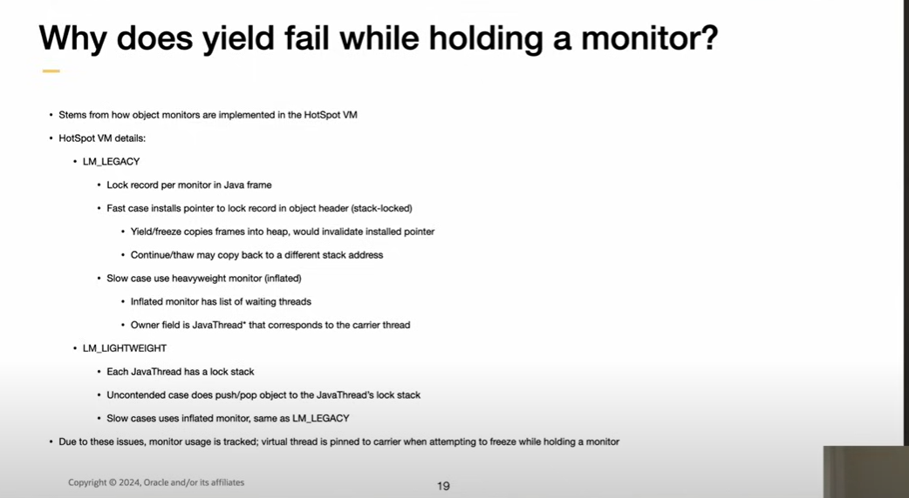

::: block
*Virtual Threads* {style=background:red;width:500px}
:::

---

### What's the talk about?

Virtual threads (aka green threads, fibers (though Windows has [a fiber which is different](https://learn.microsoft.com/en-us/windows/win32/api/winbase/nf-winbase-convertthreadtofiber)), spaghetti stacks, stack groups), the attempts at implementing them in the two big managed platforms, and how they change the look of your programs.

---

### Why?

[Little's law](https://en.wikipedia.org/wiki/Little%27s_law)

In mathematical queueing theory, Little's law is a theorem by John Little which states that the long-term average number L of customers in a stationary system is equal to the long-term average effective arrival rate λ multiplied by the average time W that a customer spends in the system. Expressed algebraically the law is 𝐿=𝜆𝑊.

---

The relationship is not influenced by the arrival process distribution, the service distribution, the service order, or practically anything else. In most queuing systems, service time is the bottleneck that creates the queue.

---

[At massive scale, in a request-per-thread model we need to serve as many requests as possible (and operating system threads only go so far)](https://openjdk.org/jeps/425)

---

| Term | Meaning |
| ---- | ------ |
|Process | an isolated virtual address space (Pico process), likely a security boundary |
| Thread | something that exists in the context of a process, and brings computation |
| Scheduler | Part of the OS that uses premption to share a CPU | 
| User-mode scheduling | schedule the computations ourselves because we understand this program better than the OS |

---

### Why now?

[Project Loom](https://openjdk.org/projects/loom/) - Fibers, Continuations and Tail-Calls for the JVM

The goal of this Project is to explore and incubate Java VM features and APIs built on top of them for the implementation of lightweight user-mode threads (fibers), delimited continuations (of some form), and related features, such as explicit tail-call.

---

But around for so long...

Sql Server has done user mode scheduling for a long time (SQL OS)

---

### Java

Generally available in Java 21 but with a few issues remaining

[Java's virtual threads - Next steps](https://www.youtube.com/watch?v=KBW4LbCoo6c)

---


---

### More details

[Continuations - Under the Covers #JVMLS](https://www.youtube.com/watch?v=6nRS6UiN7X0)

- Virtual threads and carrier threads
- Parking and Unparking

---


---


---

### VM mechanics

When parking happens, the continuation is moved off the thread, and another continuation is executed there.

---


---

### So what?

You write Java code that looks like normal Java code, and the VM can virtualize the thread for you (most of the time).

Compared to the .NET way of async where you end up with normal code and Task based code, and a compiler trick to make the latter like the former.

[Red/Green function colouring](https://journal.stuffwithstuff.com/2015/02/01/what-color-is-your-function/).

---

### Before

```csharp
int GetSomeData(FileStream theStream)
{
	var bytes = new byte[100];
	var nBytes = theStream.Read(bytes, offset: 0, count: 100);
	if (nBytes > 0)
	{
		DoProcessing(bytes);
	}

	return nBytes;
}
```

---

### After or instead of or as well as

```csharp
async Task<int> GetSomeDataAsync(FileStream theStream)
{
	var bytes = new byte[100];
	var nBytes = await theStream.ReadAsync(bytes, offset: 0, count: 100);
	if (nBytes > 0)
	{
		DoProcessing(bytes);
	}

	return nBytes;
}
```

---

### And the mass of options to ConfigureAwait()

```csharp
var nBytes = await theStream
    .ReadAsync(bytes, offset: 0, count: 100)
    .ConfigureWait(ConfigureAwaitOptions.ForceYield);
```

---

### Still some edge cases where parking doesn't work



---

### And speed complaints

[Java Virtual Threads - a case study](https://www.infoq.com/articles/java-virtual-threads-a-case-study/)

---

### .NET

[The green threads experiment](https://github.com/dotnet/runtimelab/issues/2057)

[The green threads experiment ends](https://github.com/dotnet/runtimelab/issues/2398)

[The green threads write up](https://github.com/dotnet/runtimelab/blob/feature/green-threads/docs/design/features/greenthreads.md)

---

### [In particular](https://www.infoq.com/articles/java-virtual-threads-a-case-study/)

---

### Why so hard?

- VMs in the 1990s did Green Threads
- Smalltalk in the 1970s with spaghetti stacks
- Hard to retrofit into the implementation?
- Have not built the runtime in the language the runtime targets?

---

### Things to read

- [Delimited Continuations, Demystified](https://www.youtube.com/watch?v=TE48LsgVlIU)
- [call/cc (mindblowing!)](https://en.wikipedia.org/wiki/Call-with-current-continuation) and [Griffin's paper](https://www.cl.cam.ac.uk/~tgg22/publications/popl90.pdf)
- [Is Reactive Programming Dead?](https://www.youtube.com/watch?v=eAjy7E_FQN0)
- [Async wrappers for synchronous](https://devblogs.microsoft.com/pfxteam/should-i-expose-asynchronous-wrappers-for-synchronous-methods/)
- [Synchronous wrappers for async](https://devblogs.microsoft.com/pfxteam/should-i-expose-synchronous-wrappers-for-asynchronous-methods/)
