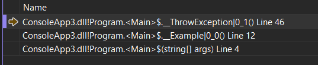
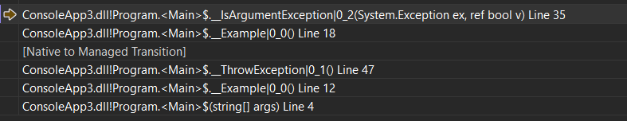
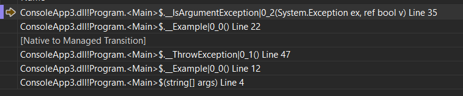
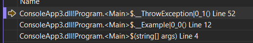
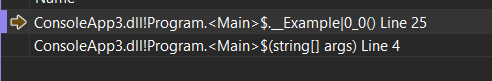
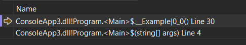

# What the heck is a funclet?

---

## What does exception handling need to do?

---

- Note that we've seen filters and finally, and catch but we haven't seen fault

Used to be used in MoveNext implementation to Dispose the enumerator if the MoveNext threw an exception

---

### Why that example?

- It shows that we have to walk the stack to find out where the catch happens
- It shows the filter needs access to the stack frame where the Example code is running
- It shows that we have two phases - first pass and second pass

---

```CSharp
void Example()
{
    var checkedForArgumentExceptionBefore = false;

    try { ThrowException(); }
    catch (ArgumentException ex) when (IsArgumentException(ex)) {}
    catch (Exception ex) when (IsArgumentException(ex)) {}
    catch (Exception ex) when (IsArgumentException(ex)) {   /* 5 */ }
    finally { /* 6 */ }

    bool IsArgumentException(Exception ex)
    {
        /* 2 */ /* 3 */
        var lastValue = checkedForArgumentExceptionBefore;
        checkedForArgumentExceptionBefore = true;
        return lastValue;
    }
}

void ThrowException()
{
    try { /* 1 */ throw new Exception(); } finally { /* 4 */ }
}
```

---

### 1

```CSharp
try { /* 1 */ throw new Exception(); } finally { /* 4 */ }
```



---

### 2

Inside Argument Exception



We haven't unwound yet, but need to access the local in the stack frame two back (or generate a closure)

---

### 3

Inside Argument Exception



We haven't unwound yet, but need to access the local in the stack frame two back (or generate a closure)

---

### 4

- First pass has located the target
- Start the second pass
- Unwind the later stack frames and execute any finally blocks as we go



---

### 5

```CSharp
catch (Exception ex) when (IsArgumentException(ex)) {   /* 5 */ }
```



### 6

- And we now exit Example so do the finally

```CSharp
finally { /* 6 */ }
```



---

### So what's so special about that?

- Let's look at the 2nd and 3rd stop points again


- the debugger says we are in the same .NET function twice
- and we need access to the local variable
- and we need it without slowing the fast path
- which would just store the local in the stack frame

---

### So that's the funclet

- The code for the exception path is appended to the end of the normal .NET code
- (exception blocks are encoded as a table in the CLR)
- this keeps it out of the cache for the hot path
- but it isn't entered like a normal method
- which has a standard prolog and epilog
- it instead has a slightly different calling convention
