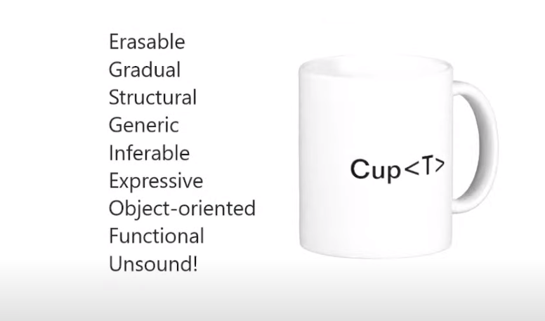
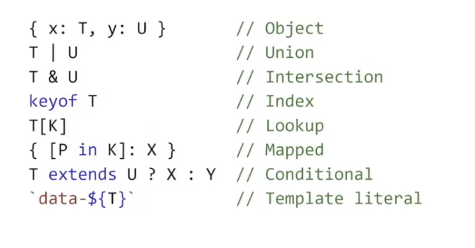

::: block
*Lessons from a few lines of code* {style=background:red;width:500px}
:::

---

### Why's TypeScript's Type System Different

- [See the Hejlsberg talk at ICFP](https://www.youtube.com/live/d0zFruedB-w?si=BaKI1LX3F3KKXZBD&t=763)
- This is a type system for the sake of tooling 
  - not runtime safety or compilers
- Arbitary limits in certain places to keep it feelig fast

---

 

---

 

---

### And much more

- [And the rather cool infer](https://blog.logrocket.com/understanding-infer-typescript/)

- [And it is Turing Complete](https://itnext.io/implementing-arithmetic-within-typescripts-type-system-a1ef140a6f6f)

---

### But we are just going to look at Zod

- some parts are as implemented as in Zod, and some aren't
  - `npm run start`
  - simple-zod.ts

---

### References

- [a partial how to build Zod talk](https://youtube.com/watch?v=6zojOpZGrtg&si=1IlO3qiuvJlHW7dd)
